[Descargar PDF](https://raw.githubusercontent.com/juanisil/TDVIII-proyecto-final/refs/heads/main/TD8_-Informe-Final.pdf)

# Abstract

En la última década, el análisis deportivo ha evolucionado hacia una perspectiva cada vez más matemática y sofisticada. Aplicaciones como el uso de análisis espacial en Basketball [@goldsberry_2012_courtvision] y la investigación estadística del Brentford con Smartodds son ejemplos claros de la tendencia creciente en este campo. El béisbol, por mucho tiempo el deporte preferido para la analítica, ha experimentado una profunda transformación con la implementación de Sabermetrics [@baumer_2015_sabermetric]. La introducción de herramientas analíticas avanzadas ha producido resultados positivos para muchos equipos, lo que resalta el valor de estudiar métricas específicas dentro de cada deporte.

Este desarrollo se centra en el fútbol, un deporte en el cual los análisis previos se han concentrado, en su mayoría, en predecir resultados de partidos y mejorar el rendimiento de los equipos. Sin embargo, este trabajo propone un enfoque diferente al analizar el impacto de los jugadores sobre la posesión de balón y los disparos del equipo desde una perspectiva probabilística.

A partir de la métrica PSL propuesta en el paper *Soccer Networks* [@huang_soccer_networks] planteamos un proceso para comparar el impacto que tienen los jugadores sobre la performance del equipo. Logramos formular una metodología para estudiar la distribución de la performance de un equipo. Luego, proponemos una serie de métodos y métricas para comparar el rendimiento de dos formaciones de jugadores. Además, desarrollamos una forma de representación vectorial (Embeddings) de los jugadores, llamada Player2Vec, un modelo de Machine Learning también basado sobre el modelo de redes de jugadores planteado en el mismo paper del PSL. Esto último permite desarrollar modelos predictivos sobre el rendimiento de los jugadores en un equipo. Nuestro modelo final logra predecir la performance de los jugadores un 58.99% mejor que asumir las distribuciones previas como _priors_.

Palabras Clave: Fútbol, Análisis de Datos, Machine Learning, Redes de Jugadores, Embeddings, Expected Goals, Cadenas de Markov


\newpage
\cleardoublepage

# **Agradecimientos** {#agradecimientos}

Este trabajo no hubiera sido posible sin la ayuda de los profesores Gustavo Vulcano (Escuela de Negocios, Universidad Torcuato Di Tella) y Santiago Gallino (The Wharton School, University of Pennsylvania). Además queremos agradecer a Ignacio Vigilante (TIC \- Escuela ORT) y Tomás Spognardi (Exactas \- UBA) por sus contribuciones al modelo de Player2Vec y al PSL Bayesiano respectivamente. Agradecemos también a nuestras familias, amigos, colegas y jefes por su apoyo y acompañamiento durante el transcurso de nuestras carreras universitarias.

\newpage

\cleardoublepage

# **Introducción** {#introducción}

<!-- Presenta el tema del trabajo, su contexto y la importancia. Aquí se debe captar el interés del lector, explicando brevemente los aspectos más importantes que se desarrollarán. -->

A diferencia de otros deportes como el béisbol o el basketball, el fútbol ha sido tradicionalmente menos propenso a la aplicación de técnicas avanzadas de análisis de datos y aprendizaje automático. Sin embargo, en los últimos años ha habido un crecimiento significativo en el uso de herramientas analíticas para evaluar el rendimiento de los jugadores y los equipos.

En la última década el análisis del fútbol ha evolucionado hacia una perspectiva cada vez más matemática y sofisticada. El desarrollo que más impacto tuvo sin dudas es el de la métrica de Expected Goals (**xG**) [@green_2012], que permiten evaluar la calidad de las oportunidades de gol de un equipo. El uso de **xG** en el análisis de partidos y jugadores ha permitido una mayor capacidad predictiva y una mejor comprensión del rendimiento de los equipos. La industria que mas potenció este cambio fue la de las apuestas deportivas, que comenzó a utilizar modelos predictivos para estimar las probabilidades de los partidos. La aparición de empresas como StatsBomb y Opta Sports son claros ejemplos de como la analítica de datos ha crecido en importancia en la industria del fútbol. Tanto es asi que el Arsenal y el Brentford de la Premier League poseen sus propias empresas de analítica de datos; StatDNA y Smartodds [@tippett_2019, p. 37].

El trabajo en desarrollo *Soccer Networks* [@huang_soccer_networks] propone un modelo de red de jugadores para calcular la probabilidad de disparar al arco antes de perder el balón (**PSL**), una métrica poca estudiada. En el paper se demuestra que el **PSL** tiene una alta correlación con el rendimiento del equipo y una gran importancia al nivel del **xG**.

Este trabajo profundiza en el análisis de la métrica **PSL** y propone un análisis probabilístico sobre las componentes del modelo de redes de jugadores y su injerencia en el rendimiento de los jugadores y consecuentemente del equipo. Proponemos una metodología para comparar el rendimiento de jugadores y formaciones de jugadores en base a la métrica **PSL**. Finalmente, desarrollamos un modelo de representación vectorial de los jugadores, llamado **Player2Vec**, para poder utilizarlo en modelos predictivos sobre el rendimiento de los jugadores.

\newpage

\cleardoublepage

# **Motivación** {#motivación}

<!-- Explica **por qué el tema elegido es relevante**, tanto a nivel académico como práctico. Debe argumentar la importancia del trabajo para el campo de estudio o la sociedad. Similar a lo que se completó en el formulario de licitación de proyectos iniciales. -->

El fútbol es uno de los deportes más populares y seguidos en todo el mundo. La capacidad de un equipo para ganar partidos y campeonatos depende en gran medida de la calidad y el rendimiento de sus jugadores. En este contexto, la identificación y selección de los mejores jugadores para un equipo se convierte en una tarea crucial para entrenadores, directores deportivos y analistas de rendimiento.

## Relevancia Académica

Desde una perspectiva académica, el análisis del rendimiento de los jugadores de fútbol ha sido un área de interés creciente en los últimos años. La aplicación de técnicas avanzadas de análisis de datos, aprendizaje automático y modelos probabilísticos ha permitido una comprensión más profunda del impacto de los jugadores en el rendimiento del equipo. Algunos ejemplos del estado del arte incluyen el modelo para maximizar la posesión esperada propuesto en el artículo de [@rahimian_2023] y el modelo de redes de jugadores para calcular la probabilidad de disparar al arco antes de perder el balón (PSL) presentado en el trabajo de [@huang_soccer_networks].

Este trabajo se enmarca en esta línea de investigación, contribuyendo al desarrollo de nuevas metodologías y herramientas para evaluar y comparar el rendimiento de los jugadores.

## Relevancia Práctica

En el ámbito práctico, la capacidad de identificar a los mejores jugadores tiene implicaciones directas en la toma de decisiones estratégicas y operativas de los equipos de fútbol. La correcta selección de jugadores puede mejorar significativamente el rendimiento del equipo, aumentar las probabilidades de éxito en competiciones y optimizar la inversión en fichajes. 

El Brentford FC es un caso de ejemplo del impacto positivo que puede tener el análisis de datos en el fútbol. El club implementó un enfoque basado estadística para la identificación y selección de jugadores con alto potencial de rendimiento. El equipo para el 2014/2015 había ascendido a la EFL Championship desde la Ligue One (Tercera División de Inglaterra) por primera vez en 21 años, y en 2021 ascendió a la Premier League luego de 74 años.

Mas recientemente, el caso de estudio sobre el Real Racing Club de Santander de la Segunda División B de España presentado por la Facultad de Ciencias Exactas y Naturales, UBA en la 33rd European Conference on Operational Research es un nuevo caso de aplicación de la analítica de datos en el fútbol [@brunetti_2024]. El estudio muestra con su investigación cómo integrar el proceso actual de scouting con un modelo de aprendizaje supervisado.

Partiendo de estos antecedentes, este trabajo busca proporcionar a los equipos de fútbol herramientas y metodologías para evaluar, comparar y seleccionar a los jugadores más adecuados para sus necesidades y estrategias específicas.

\newpage

\cleardoublepage

# **Objetivos de Proyecto** {#objetivos-de-proyecto}

## Objetivo General

El objetivo principal de este proyecto es desarrollar y aplicar modelos avanzados de análisis de datos y probabilísticos, para mejorar la evaluación, comparación y selección de jugadores de fútbol. Esto permitirá a los equipos tomar decisiones más informadas y estratégicas, optimizando su rendimiento y aumentando sus probabilidades de éxito en competiciones. Más concretamente, este trabajo busca responder la pregunta del título "¿Cómo encontrar el mejor jugador para tu Equipo de Fútbol?".

## Objetivos Específicos

1. **Desarrollar un Modelo de Evaluación del Rendimiento de Jugadores**:
   - Analizar las componentes del modelo de red de jugadores.
   - Explotar el modelo PSL para estimar el impacto de los jugadores en el rendimiento del equipo.
   - Crear una representación vectorial de cada jugador para poder utilizarlas en modelos predictivos.

2. **Comparar el Rendimiento de Jugadores**:
   - Establecer métricas estandarizadas para comparar objetivamente el rendimiento de jugadores en diferentes posiciones y roles.
   - Aplicar técnicas de aprendizaje automático y análisis de datos para identificar patrones y tendencias en el rendimiento de los jugadores.

3. **Optimizar la Selección de Jugadores**:
   - Desarrollar un sistema de recomendación para identificar a los jugadores que mejor se adaptan a las necesidades y estrategias específicas de un equipo.
   - Evaluar la efectividad del sistema de recomendación mediante estudios de caso y análisis de datos históricos.

4. **Validar los Modelos**:
   - Realizar pruebas y validaciones de los modelos desarrollados utilizando datos reales de partidos y jugadores.

5. **Generar Conocimiento y Herramientas para la Comunidad**:
   - Documentar y publicar los resultados y metodologías desarrolladas en el proyecto.
   - Crear herramientas y recursos accesibles para entrenadores, analistas y directores deportivos que deseen aplicar estos modelos en sus equipos.

\newpage

\cleardoublepage

# **Definición del problema** {#definición-del-problema}

A partir de la pregunta de la investigación, se plantea el problema de encontrar el jugador ideal para un equipo de fútbol. En un comienzo nos encontramos planteando cómo definir la _performance_ de un jugador y cómo compararla con otros jugadores. Surgió la necesidad de encontrar una métrica para evaluar el impacto de un jugador en el rendimiento de un equipo y cómo definir estos agentes. Además es necesario poder representar concretamente a un Jugador $J$ de forma vectorial para poder utilizarlo en modelos predictivos.

## PSL como métrica de Performance 

En el paper en proceso *Soccer Networks* [@huang_soccer_networks] se plantea la descomposición del Gol Esperado ($xG$) como:

$$
    xG(A) = P(A) \cdot PSL(A) \cdot SA(A)
$$

Donde $A$ es el equipo, $P(A)$ es el número de posesiones del balón, $PSL(A)$ es la probabilidad de patear al arco antes de perder el balón y $SA(A)$ es la probabilidad de que un disparo al arco se convierta en gol. A diferencia de la posesión del balón y la probabilidad de convertir un disparo en gol, $PSL(A)$ no es una métrica comúnmente utilizada en el análisis de fútbol ni existen modelos que la calculen. El paper *Soccer Networks* plantea un modelo de red de jugadores que permite calcular $PSL(A)$ para cada equipo.

## Modelo de Red de Jugadores

Utilizando Cadenas de Markov de Tiempo Continuo (CTMC) se puede calcular la probabilidad de que un equipo pierda el balón antes de patear al arco. En este modelo de red de jugadores se plantea un modelo de 14 estados: 11 jugadores ($J_{1} \dots J_{11}$), Ganancia, Pérdida y Disparo. 

\begin{figure}
  \includegraphics{recursos_pdf/graficos/soccer_network.png}
  \caption{Modelo de Red de Jugadores}\label{fig:soccernetwork}
\end{figure}

```{r soccernetwork, fig.cap="Modelo de Red de Jugadores", echo = FALSE}
knitr::include_graphics("recursos_pdf/graficos/soccer_network.png")
```

El grafo presentado en la figura \@ref(fig:soccernetwork) representa el modelo de red de jugadores. Cada nodo representa un estado y cada arista representa una transición entre estados. El nodo verde representa el estado de disparo al arco, el rojo la pérdida del balón, el negro la ganancia del balón por parte del equipo y los azules a los jugadores. Los ejes entre los nodos se representan con una matriz de adyacencia $R$ donde cada valor $r(U, V)$ representa el ratio de transición entre los estados $U$ y $V$. 

$$
    R = \begin{pmatrix}
        0 & r(G, J_{1}) & \dots & r(G, J_{11}) & 0 & 0 \\
        0 & 0 & \dots & r(J_{1}, J_{11}) & r(J_{1}, L) & r(J_{1}, S) \\
        \vdots & \vdots & \ddots & \vdots & \vdots & \vdots \\
        0 & r(J_{11}, J_{1}) & \dots & 0 & r(J_{11}, L) & r(J_{11}, S) \\
        0 & 0 & \dots & 0 & 1 & 0 \\
        0 & 0 & \dots & 0 & 0 & 1 \\
    \end{pmatrix}
$$

Los ratios de transición posibles se calculan de la siguiente manera:

$$
\begin{aligned}
  r(G, J_{i}) &= \frac{\text{Ganancias de }J_{i}}{\text{Tiempo Jugado por }J_{i}} \\
  r(J_{i}, S) &= \frac{\text{Disparos al arco de }J_{i}}{\text{Tiempo Jugado por }J_{i}} \\
  r(J_{i}, S) &= \frac{\text{Disparos al arco de }J_{i}}{\text{Tiempo Jugado por }J_{i}} \\
  r(J_{i}, J_{j}) &= \frac{\text{Pases de }J_{i} \text{ al jugador }J_{j}}{\text{Tiempo jugado entre }J_{i} \text{ y }J_{j}} \\
\end{aligned}
$$

A partir de $R$, la matriz de ratio de acción sobre tiempo jugado (ganancias, pases, disparos o pérdidas), se puede obtener la matriz de transición de estados $Q$ al normalizar sus filas.

Para cada par de estados $U$ y $V$ se define $q(U, V) = \frac{r(U, V)}{\sum_{i=1}^{14} r(U, i)}$

$$
    Q = \begin{pmatrix}
        0 & q(G, J_{1}) & \dots & q(G, J_{11}) & 0 & 0 \\
        0 & 0 & \dots & q(J_{1}, J_{11}) & q(J_{1}, L) & q(J_{1}, S) \\
        \vdots & \vdots & \ddots & \vdots & \vdots & \vdots \\
        0 & q(J_{11}, J_{1}) & \dots & 0 & q(J_{11}, L) & q(J_{11}, S) \\
        0 & 0 & \dots & 0 & 1 & 0 \\
        0 & 0 & \dots & 0 & 0 & 1 \\
    \end{pmatrix}
$$

Finalmente a partir de la matriz de probabilidades de transición $Q$ se puede calcular $PSL(A)$ como:

$$
    PSL(A) = [1, 0, ..., 0] \cdot (I - T)^{-1} \cdot X \cdot [0, 1]^T
$$

Siendo $T$ las probabilidades de transición de los estados transitorios, $X$ las probabilidades de transición de los estados transitorios a los estados absorbentes e $I$ la matriz identidad [@ross_2019_introduction].

A partir de este modelo en el paper *Soccer Networks* se evaluó para una temporada de la Premier League (EPL 2012/13) [@opta] la diferencia entre los PSL de cada equipo y luego de forma empírica se demuestra como el $PSL(A)$ tiene alta correlación positiva con el rendimiento del equipo por sobre el contrincante. Finalmente hallamos una métrica significativa de rendimiento de un equipo en la métrica $PSL$. Sin embargo, da a lugar a la investigación de cómo se puede aplicar esta métrica a nivel de jugador y cómo se puede comparar el rendimiento de jugadores en distintos equipos.

Para evaluar el impacto de un jugador $J$ se debe conocer la probabilidad de transición entre $J$ y los otros 13 estados (10 jugadores, Ganancia, Pérdida y Disparo), o bien lograr estimar la probabilidad de transición entre $J$ y los otros 13 estados.

En este trabajo se propone un método probabilístico bayesiano para hallar la Distribución del PSL dada la distribución de probabilidades de transición entre cada uno de los 11 jugadores y los otros 13 estados.

## Modelo Predictivo de probabilidades de transición

En un comienzo se planteó desarrollar un modelo predictivo para estimar los ratios de transición entre los estados. Optamos por buscar predecir los ratios $r$ y no las probabilidades de transición $q$ ya que al normalizar los ratios de transición se pierde información sobre la cantidad de acciones de un jugador, por lo que las mismas posiciones de las matrices $R$ y $Q$ no son comparables. Más concretamente buscamos estimar la función $f$ que mapea los estados $U$ y $V$ al ratio de transición $r(U, V)$.

$$
    \hat{r}(U, V) = f(U, V, \theta)
$$

Comenzamos armando un modelo para predecir únicamente los ratios de pases $r(J_i, J_j)$ entre un jugador $J_i$ y otro jugador $J_j$. Lo que correspondería a los siguientes valores de la matriz $R$:

$$
    R = \begin{pmatrix}
        0 & r(G, J_1) & \dots & r(G, J_{11}) & 0 & 0 \\
        0 &  \color{blue}{0} & \color{blue}{\dots} & \color{blue}{r(J_1, J_{11})} & r(J_1, L) & r(J_1, S) \\
        \vdots & \color{blue}{\vdots} & \color{blue}{\ddots} & \color{blue}{\vdots} & \vdots & \vdots \\
        0 & \color{blue}{r(J_{11}, J_1)} & \color{blue}{\dots} & \color{blue}{0} & r(J_{11}, L) & r(J_{11}, S) \\
        0 & 0 & \dots & 0 & 1 & 0 \\
        0 & 0 & \dots & 0 & 0 & 1 \\
    \end{pmatrix}
$$


Para poder utilizar un modelo de machine learning tradicional necesitamos poder representar a cada jugador $J$ de forma vectorial. Armamos un vector de métricas agregadas para un jugador al momento del partido a predecir. Estas métricas incluyen la cantidad de pases, disparos, goles, pérdidas, etc. sobre el total de tiempo jugado, además de el equipo en el que juega.

$$
    J = [\text{Passes/90}, \text{Shots/90}, \text{Goals/90}, \text{Losses/90}, \text{Time Played}, \text{Team ID}]
$$

Para el modelo predictivo comenzamos utilizando un modelo de XGBoost para la regresión [@chen_2016_xgboost] pero rápidamente observamos que por la naturaleza de árbol al predecir con la media de las observaciones por hoja las predicciones resultaban casi discretas, por lo que viramos a explorar un modelo mas sencillo de regresión lineal para predecir los ratios de pases entre jugadores.

Para validar elegimos separar de forma temporal los 380 partidos de la temporada 2012/13 de la EPL: los primeros 269 partidos de entrenamiento; los últimos 111 de test ($\mu + 2/3 \sigma$). Además para construir el dataset, elegimos agarrar parejas de jugadores de los partidos de Train y removerlos de los mismos para poder en Test predecir ratios de transición entre jugadores que no se vieron en Train.

Luego de entrenar el modelo, para cada instancia de test obtuvimos la matriz de ratios de transición $R$ y calculamos el PSL real, para luego predecir la matriz de transición $\hat{R}$ y calcular el PSL predicho. Finalmente calculamos el coeficiente de correlación de Pearson entre el PSL real y el PSL predicho. 

En la figura \@ref(fig:regresionlinealrp) podemos observar como a pesar de predecir muy pobre los ratios de transición al resultar en un coeficiente de correlación de Pearson entre los $r(J_i, J_j)$ y los $\hat{r}(J_i, J_j)$ de $0.12$, sin embargo al comparar el PSL real del PSL calculado a partir de $\hat{R}$ se obtiene un coeficiente de correlación de Pearson de $0.85$.


\begin{figure}
  \includegraphics{recursos_pdf/graficos/regresion_lineal_r_p.png}
  \caption{Resultados Modelo de Regresión Lineal}\label{fig:regresionlinealrp}
\end{figure}

```{r regresionlinealrp, fig.cap="Resultados Modelo de Regresión Lineal", echo = FALSE}
knitr::include_graphics("recursos_pdf/graficos/regresion_lineal_r_p.png")
```

El modelo planteado no es capaz de predecir los ratios de transición, y a pesar de que desarrollamos otros modelos como XGBoost para regresión, Redes Neuronales y Redes Neuronales Probabilísticas (PNNs) no es posible predecir los ratios de transición entre los estados a partir de las métricas de los jugadores. Se debe a que los ratios de transición pueden variar mucho entre partidos para un mismo jugador. Para entender mejor el efecto de estos ratios, decidimos observar como cada ratio de transición afecta al PSL.

## Test de Sensibilidad sobre PSL

Para entender mejor la relación entre los ratios de transición y el PSL, se implementó el modelo en una librería de auto-diferenciación (pytorch) y se obtuvo el gradiente de PSL empíricamente respecto a los ratios de transición. Esto nos permitió entender qué estados tienen mayor influencia en la métrica que estamos analizando.
Pudimos observar que las transiciones de Jugador a Shot son las que más inciden sobre el PSL, seguido por las transiciones entre jugadores, tal como se observa en la figura \@ref(fig:pslgradient).


\begin{figure}
  \includegraphics{recursos_pdf/graficos/psl_gradient.jpeg}
  \caption{Gradiente del PSL}\label{fig:pslgradient}
\end{figure}

```{r pslgradient, fig.cap="Gradiente del PSL", echo = FALSE}
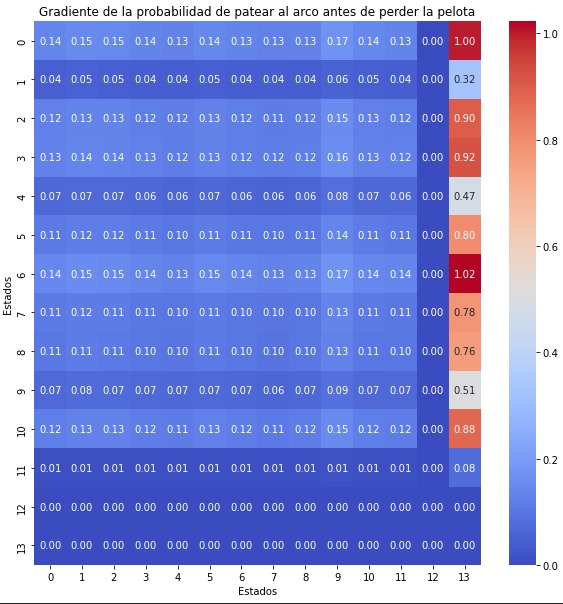
```

## Modelo Predictivo sobre $r(J, S)$

Luego de lo observado con el Test de Sensibilidad sobre PSL, decidimos cambiar el enfoque de la predicción de los ratios de transición entre jugadores a la predicción de los ratios de transición entre jugadores y el estado de disparo al arco. Esto se debe a que al observar la matriz de ratios de transición $R$ se observa que los ratios de transición entre jugadores y el estado de disparo al arco son los que más afectan al PSL.

El nuevo modelo se enfoca en la siguiente sección de la matriz $R$:

$$
    R = \begin{pmatrix}
        0 & r(G, J_{1}) & \dots & r(G, J_{11}) & 0 & 0 \\
        0 & 0 & \dots & r(J_{1}, J_{11}) & r(J_{1}, L) & \color{blue}{r(J_{1}, S)} \\
        \vdots & \vdots & \ddots & \vdots & \vdots & \color{blue}{\vdots} \\
        0 & r(J_{11}, J_{1}) & \dots & 0 & r(J_{11}, L) & \color{blue}{r(J_{11}, S)} \\
        0 & 0 & \dots & 0 & 1 & 0 \\
        0 & 0 & \dots & 0 & 0 & 1 \\
    \end{pmatrix}
$$

Para el vector de los jugadores $J$ se agregó también la posición en la que juega (Arquero G por Goalkeeper, Defensor D por Defender, Mediocampista M por Midfielder, Delantero F por Forward) one-hot-encoded.

Luego se entrenó un modelo de XGBoost para Regresión con el mismo split de Train y Test. Se logró obtener un mejor resultado sobre las predicciones de Train en comparación al modelo anterior. Se obtuvo un coeficiente de correlación de Pearson de $0.95$ entre los $r(J_i, S)$ y los $\hat{r}(J_i, S)$ en Train, pero de $0.08$ en Test.

\begin{figure}
  \includegraphics{recursos_pdf/graficos/xgb_shots.png}
  \caption{Resultados Modelo de XGBoost}\label{fig:xgbshots}
\end{figure}

```{r xgbshots, fig.cap="Resultados Modelo de XGBoost", echo = FALSE}
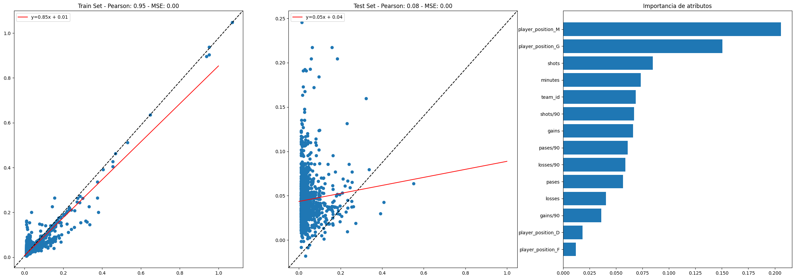
```


Este resultado junto al del modelo de predicción de ratios de pases nos llevó a buscar una mejor representación vectorial de los jugadores. En la Sección [Player2Vec](#player2vec) se explica el modelo utilizado para obtener un vector de representación (embedding E) de cada jugador. Con este embedding de input modelamos la función como una red neuronal, para obtener un modelo resultante $f (E(J) , \text{partido})$ que dado el embedding de los jugadores y el partido, predice los ratios de transición entre jugadores y el estado de disparo al arco.

\newpage

\cleardoublepage

# **Análisis de las distribuciones de los Ratio de Transición a Disparo al Arco** $r(J, S)$

En un esfuerzo de comprender mejor el modelo de ratios de transición entre jugadores y el estado de disparo al arco, se decidió analizar las distribuciones de los $r(J, S)$ para cada jugador en la temporada 2012/13 de la EPL. 

Se observó que las distribuciones de los ratios de transición entre jugadores y el estado de disparo al arco tienen moda cercana a 0, lo que indica que la mayoría de los jugadores tienen una baja probabilidad de disparar al arco antes de perder el balón. En la siguiente figura se puede observar la distribución de los $r(J, S)$ para todos los jugadores de la temporada 2012/13 de la EPL en todos los partidos.

\begin{figure}
  \includegraphics{recursos_pdf/graficos/Probabilidad_de_disparo.png}
  \caption{Distribución de todos los $r(J, S)$}\label{fig:Probabilidaddedisparo}
\end{figure}

```{r Probabilidaddedisparo, fig.cap="Distribuci&oacuten de todos los $r(J, S)$", echo = FALSE}
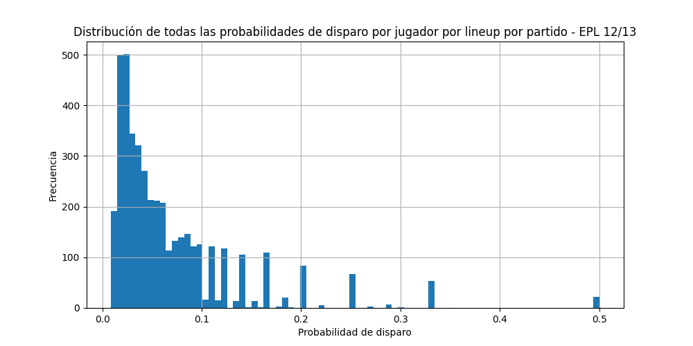
```

Además, se observó que la distribución de los $r(J, S)$ de cada jugador no necesariamente sigue una distribución normal ni similar a la de otros jugadores. Para el siguiente análisis se ajustaron las distribuciones de los $r(J, S)$ de cada jugador a una distribución de probabilidad beta y se obtuvieron los parámetros $\alpha$ y $\beta$ de cada jugador. Inicialmente presentamos la distribución de dos jugadores a modo de ejemplo: **Sergio Agüero** y **Robin van Persie**

\begin{figure}
  \includegraphics{recursos_pdf/graficos/Sergio_Aguero_Robin_van_Persie_shots_prob_beta_binomial.png}
  \caption{Distribución de los $r(J, S)$ de Sergio Agüero y Robin van Persie}\label{fig:SergioAgueroRobinvanPersieshotsprobbetabinomial}
\end{figure}

```{r SergioAgueroRobinvanPersieshotsprobbetabinomial, fig.cap="Distribuci&oacuten de los $r(J, S)$ de Sergio Agüero y Robin van Persie", echo = FALSE}
knitr::include_graphics("recursos_pdf/graficos/Sergio_Aguero_Robin_van_Persie_shots_prob_beta_binomial.png")
```

Luego se analizó la distribución de los $r(J, S)$ de los 10 jugadores con mayor cantidad de disparos, con mayor sesgo y con mayor suma de disparos a modo de comparación. En el [anexo](#anexo) se presentan gráficos correspondientes junto a otras distribuciones pertinentes, ver figuras \@ref(fig:Top10bycountsplayersshotsprobbetabinomial), \@ref(fig:Top10byskewplayersshotsprobbetabinomial), \@ref(fig:Top20Forwardsbyskewplayersshotsprobbetabinomial), \@ref(fig:Top10bysumplayersshotsprobbetabinomial)

## Comparación de las distribuciones de los $r(J, S)$

A partir de la distribución ajustada de un jugador, podemos hallar jugadores similares en base a la distribución de los $r(J, S)$ utilizando la divergencia de Kullback-Leibler (KL) [@kullback_1951]. La divergencia KL es una medida de la diferencia entre dos distribuciones de probabilidad. Para dos distribuciones de probabilidad $P$ y $Q$, la divergencia KL se define como:

$$
    D_{KL}(P||Q) = \sum_{i} P(i) \log \left( \frac{P(i)}{Q(i)} \right)
$$

En la figura \@ref(fig:SimilartoSergioAgueroshotsprobbetabinomial) se observa la distribución de los $r(J, S)$ de jugadores similares a él en la temporada 2012/13 de la EPL. Además se presentan solapados en la figura \@ref(fig:SergioAgueroandsimilarplayersshotsprobbetabinomial).

\begin{figure}
  \includegraphics{recursos_pdf/graficos/Similar_to_Sergio_Aguero_shots_prob_beta_binomial.png}
  \caption{Distribución de los $r(J, S)$ de jugadores similares a Sergio Agüero}\label{fig:SimilartoSergioAgueroshotsprobbetabinomial}
\end{figure}

```{r SimilartoSergioAgueroshotsprobbetabinomial, fig.cap="Distribuci&oacuten de los $r(J, S)$ de jugadores similares a Sergio Agüero", echo = FALSE}
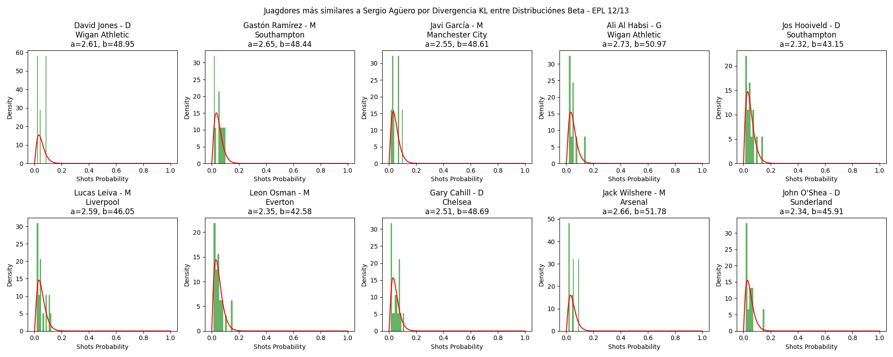
```

\begin{figure}
  \includegraphics{recursos_pdf/graficos/Sergio_Aguero_and_similar_players_shots_prob_beta_binomial.png}
  \caption{Distribución de los $r(J, S)$ de jugadores similares a Sergio Agüero Superpuestos}\label{fig:SergioAgueroandsimilarplayersshotsprobbetabinomial}
\end{figure}

```{r SergioAgueroandsimilarplayersshotsprobbetabinomial, fig.cap="Distribuci&oacuten de los $r(J, S)$ de jugadores similares a Sergio Agüero Superpuestos", echo = FALSE}
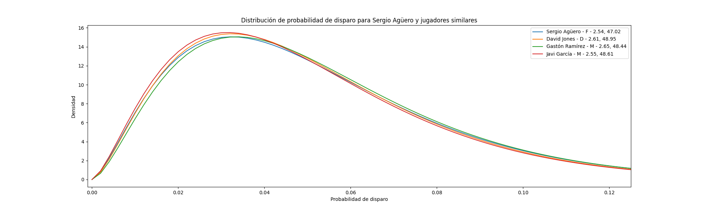
```

Finalmente podemos agregar la condición de _misma posición_ al comparar dos jugadores, en el caso de Agüero de Delantero (F por Forward) y hallar nuevamente jugadores aún más similares a él. 

\begin{figure}
  \includegraphics{recursos_pdf/graficos/Sergio_Aguero_and_similar_players_same_position_shots_prob_beta_binomial.png}
  \caption{Distribución de los $r(J, S)$ de jugadores similares a Sergio Agüero de la misma posición}\label{fig:SergioAgueroandsimilarplayerssamepositionshotsprobbetabinomial}
\end{figure}

```{r SergioAgueroandsimilarplayerssamepositionshotsprobbetabinomial, fig.cap="Distribuci&oacuten de los $r(J, S)$ de jugadores similares a Sergio Agüero de la misma posición", echo = FALSE}
knitr::include_graphics("recursos_pdf/graficos/Sergio_Aguero_and_similar_players_same_position_shots_prob_beta_binomial.png")
```

Para conocer mejor la varianza de las distribuciones de los $r(J, S)$ de los jugadores, se estudió la distribución de los parámetros $\alpha$ y $\beta$ de las distribuciones beta ajustadas. Hicimos un análisis de clustering para agrupar a los jugadores en base a sus distribuciones de los $r(J, S)$.

\begin{figure}
  \includegraphics{recursos_pdf/graficos/Clusters_of_Players_shots_prob_beta_binomial.png}
  \caption{Distribución de los parámetros $\alpha$ y $\beta$ de los $r(J, S)$ de los jugadores}\label{fig:ClustersofPlayersshotsprobbetabinomial}
\end{figure}

```{r ClustersofPlayersshotsprobbetabinomial, fig.cap="Distribuci&oacuten de los parámetros $\alpha$ y $\beta$ de los $r(J, S)$ de los jugadores", echo = FALSE}
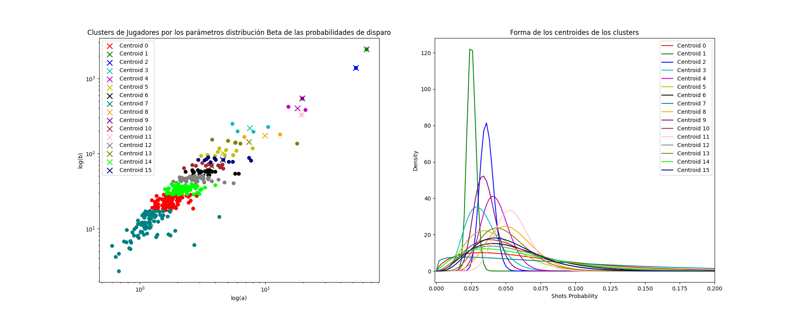
```

Como un extra, este sistema de clustering nos permite hallar rápido jugadores similares entre sí. A partir de los clusters la siguiente figura presenta las posibles distribuciones en cada cluster.

\begin{figure}
  \includegraphics{recursos_pdf/graficos/Clusters_of_Players_shots_prob_beta_binomial_distributions.png}
  \caption{Distribución de los $r(J, S)$ de jugadores en clusters}\label{fig:ClustersofPlayersshotsprobbetabinomialdistributions}
\end{figure}

```{r ClustersofPlayersshotsprobbetabinomialdistributions, fig.cap="Distribuci&oacuten de los $r(J, S)$ de jugadores en clusters", echo = FALSE}
knitr::include_graphics("recursos_pdf/graficos/Clusters_of_Players_shots_prob_beta_binomial_distributions.png")
```

\newpage

\cleardoublepage

# **Estimación de la Distribución del PSL**

A partir de los resultados obtenidos en el análisis de las distribuciones de los $r(J, S)$, se propone un utilizar estas como _priors_ para cada jugador, es decir, se asume que la distribución de los $r(J, S)$ de un jugador es la distribución _a-priori_ de la variable aleatoria $r(J, S)$ para ese jugador, lo mismo para los $r(J_i, J_j)$, los $r(J, L)$ y los $r(J, G)$.

De esta forma, cada jugador $J$ tiene una distribución _a-priori_ para cada uno de los 14 estados. Considerando esto, podemos reformular la matriz de ratios de transición como una matriz de variables aleatorias donde cada una se distribuye según la distribución _a-priori_ del jugador correspondiente.

## Variables Aleatorias para los $r(U, V)$ y PSL por _priors_

Para actualizar la notación, sean $r_{J, V}$ la variable aleatoria que representa el ratio de transición entre el jugador $J$ y el estado $V$, esto incluye $r_{J, S}$, $r_{J, L}$ y también $r_{G, J}$, asi como los $r_{J_i, J_j}$ para $i, j \in [1, 11]$.

Luego $r_{J, V} \sim F_x$ la distribución _a-priori_ de la variable aleatoria $r_{J, V}$.

Para generalizar el análisis de distribuciones planteadas en la sección anterior, se propone utilizar una distribución KDE (Kernel Density Estimation) a partir de los histogramas de los $r(J, V)$ para modelar sus distribuciones, ya que no todos los ratios de transición siguen una distribución beta tan bien como los $r(J, S)$.

Finalmente obtenemos, para una formación dada de 11 jugadores, una matriz de variables aleatorias $\mathbf{R}$.

$$
    \mathbf{R} = \begin{pmatrix}
        0 & r_{G, J_1} & \dots & r_{G, J_{11}} & 0 & 0 \\
        0 & 0 & \dots & r_{J_1, J_{11}} & r_{J_1, L} & r_{J_1, S} \\
        \vdots & \vdots & \ddots & \vdots & \vdots & \vdots \\
        0 & r_{J_{11}, J_1} & \dots & 0 & r_{J_{11}, L} & r_{J_{11}, S} \\
        0 & 0 & \dots & 0 & 1 & 0 \\
        0 & 0 & \dots & 0 & 0 & 1 \\
    \end{pmatrix}
$$

Para mejor claridad, la siguiente visualización muestra la matriz de variables aleatorias $\mathbf{R}$ para un equipo de ejemplo. En cada posición se observa la distribución _a-priori_ de la variable aleatoria correspondiente.

\begin{figure}
  \includegraphics{recursos_pdf/graficos/f9090710-1703-476a-b906-8fddde8ae6d6.png}
  \caption{Matriz de Variables Aleatorias $\mathbf{R}$}\label{fig:8fddde8ae6d6}
\end{figure}

```{r 8fddde8ae6d6, fig.cap="Matriz de Variables Aleatorias R", echo = FALSE}
knitr::include_graphics("recursos_pdf/graficos/f9090710-1703-476a-b906-8fddde8ae6d6.png")
```

## Método de Monte Carlo para estimar la distribución del PSL

Dado un equipo $A$ con una formación de 11 jugadores $L_{A}$, se busca estimar la distribución del PSL de ese equipo a partir de las distribuciones _a-priori_ de los $r(U, V)$ de cada jugador. Para ello, se propone un método de Monte Carlo para muestrear de las distribuciones _a-priori_ de los $r(U, V)$ y estimar con ellas la distribución del PSL del equipo $A$.

De la formación $L_{A}$ podemos construir la matriz de variables aleatorias $\mathbf{R}$ a partir de las distribuciones _a-priori_ de los $r(U, V)$ de cada jugador.

Definimos $\hat{f}^{N}_{PSL}(L_{A})$ como la función distribución de probabilidad empírica de los $PSL_i$ para la formación $L_{A}$ en base a $N$ simulaciones.

El proceso de Monte Carlo para estimar la distribución del PSL de la formación $L_{A}$ es el siguiente:

```{=latex}
\begin{algorithm}[H]
\caption{Simulación del PSL del equipo $A$}\label{alg:montecarlo}
\SetAlgoLined
\KwIn{Número de simulaciones $N$}
\KwIn{Formación $L_{A}$ = $\{J_1, J_2, \dots, J_{11}\}$}
\KwOut{Distribución del PSL del equipo $A$}
$\mathbf{R} \gets$ Construir la matriz de variables aleatorias a partir de las distribuciones a-priori de los $r(U, V)$ de cada jugador\;
$PSL_i \gets 0$ para $i = 1, 2, \dots, N$\;
\For{$i = 1$ \KwTo $N$}{
    $R \gets $ Muestrear de la matriz $\mathbf{R}$ distribuciones a-priori de los $r(U, V)$\;
    $Q \gets$ Normalizar las filas de $R$\;
    $PSL_i \gets PSL(Q)$\;
}
Estimar la distribución del PSL del equipo $A$ a partir de las $N$ observaciones obtenidas de las simulaciones\;
\end{algorithm}
```
<div class="algorithm">
  <h3>Simulación del PSL del equipo A</h3>
  <p><strong>Entrada:</strong> Número de simulaciones $N$</p>
  <p><strong>Entrada:</strong> Formación $L_{A}$ = $\{J_1, J_2, \dots, J_{11}\}$</p>
  <p><strong>Salida:</strong> Distribución del PSL del equipo $A$</p>
  <ol>
    <li><strong>Inicialización:</strong> $\mathbf{R} \gets$ Construir la matriz de variables aleatorias a partir de las distribuciones a-priori de los $r(U, V)$ de cada jugador</li>
    <li><strong>Inicialización:</strong> $PSL_i \gets 0$ para $i = 1, 2, \dots, N$</li>
    <li><strong>Iteración:</strong> Para $i = 1$ hasta $N$:
      <br />
      a. Muestrear $R \gets$ Muestrear de la matriz $\mathbf{R}$ distribuciones a-priori de los $r(U, V)$<br />
      b. Normalizar $Q \gets$ Normalizar las filas de $R$<br />
      c. Calcular $PSL_i \gets PSL(Q)$
    </li>
    <li><strong>Estimación:</strong> Estimar la distribución del PSL del equipo $A$ a partir de las $N$ observaciones obtenidas de las simulaciones</li>
  </ol>
</div>


A partir de esta distribución del PSL, se puede realizar comparaciones entre diferentes formaciones de 11 jugadores.

\begin{figure}
  \includegraphics{recursos_pdf/graficos/sergio_aguero_psl_distribution.png}
  \caption{Distribución del PSL del equipo Manchester City}\label{fig:SergioAgueroPSLDistribution}
\end{figure}

```{r SergioAgueroPSLDistribution, fig.cap="Distribuci&oacuten del PSL del equipo Manchester City", echo = FALSE}
knitr::include_graphics("recursos_pdf/graficos/sergio_aguero_psl_distribution.png")
```

El gráfico en la figura \@ref(fig:SergioAgueroPSLDistribution) muestra la distribución del PSL de una formacíon de ejemplo obtenida a partir de 1000 simulaciones del proceso de Monte Carlo para la formación más utilizada en la temporada 2012/13 de la EPL del equipo Manchester City (10 Jugadores del MCI + Sergio Agüero usado como ejemplo).

## Comparar el impacto sobre el PSL de dos jugadores en una formación

Para comparar el PSL de dos jugadores en una formación, se propone un análisis que consiste en evaluar el impacto en la distribución del PSL al reemplazar a un jugador por otro en la formación. El proceso para ello es el siguiente: 

Se define la Formación $L_{A}$ = $\{J_1, J_2, \dots, J_{11}\}$ como la formación original del equipo $A$, donde alguno de los jugadores $J_i$ es el jugador a "original". 

Se define el jugador $J'$ a comparar con $J_i$ y la formación $L'_A$ = $\{J_1, J_2, \dots, J_{11}\}$ como la formación con el jugador $J'$ en lugar de $J_i$.

Luego, se puede computar $\hat{f}^{N}_{PSL}(L_{A})$ y $\hat{f}^{N}_{PSL}(L'_A)$ para comparar las distribuciones del PSL de las formaciones $L_{A}$ y $L'_A$.

## Comparación de Distribuciones de PSL

En la siguiente sección postulamos una serie de métodos y métricas para comparar distribuciones de PSL de dos formaciones. En orden creciente de complejidad y rigurosidad, proponemos:

1. Comparación de Momentos Estadísticos
2. Dominancia Probabilística
3. Dominancia Estocástica

Para explicar la comparación de distribuciones de PSL, se propone un ejemplo de dos formaciones de 11 jugadores distintas, en una formación $L_{MC}$ se encuentran 10 jugadores del equipo Manchester City (MCI) + Sergio Agüero delantero del mismo equipo y en la otra $L_{MC}^{\text{Giroud}}$ los mismos 10 jugadores del MCI + Olivier Giroud delantero del equipo Arsenal.

Se realizó el proceso de Monte Carlo para estimar la distribución del PSL de cada formación a partir de 1000 simulaciones. Luego en la figura \@ref(fig:PSLDistsAgueroVGiroud) se puede observar las funciones de densidad de probabilidad aproximadas de las distribuciones del PSL de las formaciones $\hat{f}^{1000}_{PSL}(L_{MC})$ y $\hat{f}^{1000}_{PSL}(L_{MC}^{\text{Giroud}})$.

### Comparación de Momentos Estadísticos

\begin{figure}
  \includegraphics{./recursos_pdf/graficos/psl_dists_aguero_v_giroud.png}
  \caption{Ejemplo de dos distribuciones de PSL de dos formaciones distintas}\label{fig:PSLDistsAgueroVGiroud}
\end{figure}

```{r PSLDistsAgueroVGiroud, fig.cap="Ejemplo de dos distribuciones de PSL de dos formaciones distintas", echo = FALSE}
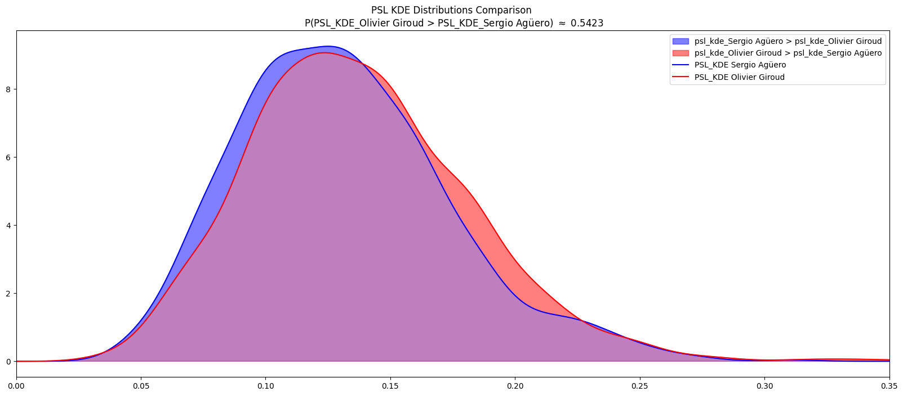
```

Una posible comparación entre las distribuciones de PSL de dos formaciones es "a ojo" observando las funciones de densidad de probabilidad. En este caso puntual se puede observar como el equipo con Agüero tiene una distribución de PSL más desplazada a izquierda que el equipo con Giroud.

En un enfoque más numérico, se puede realizar una comparación por momentos de las distribuciones de PSL de dos formaciones. Se propone comparar la media y la varianza de las distribuciones $\hat{f}^{1000}_{PSL}(L_{MC})$ y $\hat{f}^{1000}_{PSL}(L_{MC}^{\text{Giroud}})$ ya que el método de Monte Carlo nos permite obtener una muestra significativa de las distribuciones. Al no ser distribuciones normales, la skewness y la kurtosis nos proveen información adicional sobre la forma de la distribución.

<!-- Tabla Comparativa -->
```{=latex}
\begin{table}
\caption{Comparación de momentos de $\hat{f}^{1000}_{PSL}(L_{MC})$ y $\hat{f}^{1000}_{PSL}(L_{MC}^{\text{Giroud}})$}
\label{tab:comparacion_momentos_psl}
\begin{center}
\begin{tabular}{llllll}
\toprule
Jugador & Media & Varianza & Desvío Estándar & Skewness & Kurtosis \\
\midrule
Aguero & 0.130861 & 0.041160 & 0.001694 & 0.554998 & 0.362611 \\
Giroud & 0.134403 & 0.043310 & 0.001876 & 0.580404 & 0.405658 \\
\bottomrule
\end{tabular}
\end{center}
\end{table}
```

| Jugador | Media   | Varianza | Desvío Estándar | Skewness | Kurtosis |
|---------|---------|----------|-----------------|----------|----------|
| Agüero  | 0.130861| 0.041160 | 0.001694        | 0.554998 | 0.362611 |
| Giroud  | 0.134403| 0.043310 | 0.001876        | 0.580404 | 0.405658 |

Para este caso de ejemplo, se observa que la media y la varianza de las distribuciones de PSL de la formación $L_{MC}$ y $L_{MC}^{\text{Giroud}}$ son similares, aunque mayores en la formación con Giroud. Además, el tercer momento (skewness) nos confirma lo observado "a ojo" en las funciones de densidad de probabilidad, la distribución de PSL de la formación con Agüero es más sesgada a la izquierda que la de la formación con Giroud. Por último el cuarto momento (kurtosis) nos indica que la $\hat{f}^{1000}_{PSL}(L_{MC}^{\text{Giroud}})$ tiene colas más pesadas que la $\hat{f}^{1000}_{PSL}(L_{MC})$.

### Dominancia Probabilística

<!-- Metric: Probability that a random sample from one distribution is greater than a random sample from the other
This is also known as the probability of superiority or the Mann-Whitney U statistic. -->

Otra forma de comparar las distribuciones de PSL de dos formaciones es a través de la dominancia probabilística. 

En este caso, se puede calcular la probabilidad de que una muestra aleatoria de una distribución sea mayor que una muestra aleatoria de la otra distribución. De esta forma podemos tomar samples de las distribuciones $\hat{f}^{1000}_{PSL}(L_{MC})$ y $\hat{f}^{1000}_{PSL}(L_{MC}^{\text{Giroud}})$ y calcular la probabilidad de que un sample de la formación con Giroud sea mayor que un sample de la formación con Agüero.

Sean $X_{L_{MC}} \sim \hat{f}^{1000}_{PSL}(L_{MC})$ y $X_{L_{MC}^{\text{Giroud}}} \sim \hat{f}^{1000}_{PSL}(L_{MC}^{\text{Giroud}})$ las variables aleatorias que se distribuyen según las distribuciones de PSL de las formaciones $L_{MC}$ y $L_{MC}^{\text{Giroud}}$ respectivamente. Luego para evaluar si la formación con Giroud tiene dominancia probabilística sobre la formación con Agüero, se puede calcular la probabilidad $P(X_{L_{MC}^{\text{Giroud}}}>X_{L_{MC}})$.

El algoritmo para calcular la dominancia probabilística es el siguiente:

```{=latex}
\begin{algorithm}[H]
\caption{Dominancia Probabilística}\label{alg:dominancia_probabilistica}
\SetAlgoLined
\KwIn{Distribuciones de PSL $\hat{f}^{1000}_{PSL}(L)$ y $\hat{f}^{1000}_{PSL}(L')$}
\KwOut{Probabilidad de que un sample de PSL de la formación $L$ sea mayor que un sample de PSL de la formación con $L'$}
$N \gets 1000$\;
$M \gets 0$\;
\For{$i = 1$ \KwTo $N$}{
    $PSL \gets$ Muestrear de $\hat{f}^{1000}_{PSL}(L)$\;
    $PSL' \gets$ Muestrear de $\hat{f}^{1000}_{PSL}(L')$\;
    \If{$PSL' > PSL$}{
        $M \gets M + 1$\;
    }
}
$P \gets \frac{M}{N}$\;
\end{algorithm}
```

<div class="algorithm">
  <h3>Dominancia Probabilística</h3>
  <p><strong>Entrada:</strong> Distribuciones de PSL $\hat{f}^{1000}_{PSL}(L)$ y $\hat{f}^{1000}_{PSL}(L')$</p>
  <p><strong>Salida:</strong> Probabilidad de que un sample de PSL de la formación $L$ sea mayor que un sample de PSL de la formación con $L'$</p>
  <ol>
    <li>Inicializar $N \gets 1000$, $M \gets 0$</li>
    <li>Para $i = 1$ hasta $N$: 
      <br />
      a. Muestrear $PSL$ de $\hat{f}^{1000}_{PSL}(L)$<br />
      b. Muestrear $PSL'$ de $\hat{f}^{1000}_{PSL}(L')$<br />
      c. Si $PSL' > PSL$, entonces $M \gets M + 1$
    </li>
    <li>Calcular $P \gets \frac{M}{N}$</li>
  </ol>
</div>


Para el caso de ejemplo, se obtuvo que la probabilidad de que un sample de PSL de la formación con Giroud sea mayor que un sample de PSL de la formación con Agüero es $P(X_{L_{MC}^{\text{Giroud}}}>X_{L_{MC}}) \approx 0.5423$. De esta forma podemos concluir que la formación con Giroud tiene dominancia probabilística sobre la formación con Agüero.

### Comparación de CDFs de las distribuciones de PSL

Otra forma de comparar las distribuciones de PSL de dos formaciones es a través de las funciones de distribución acumulada (CDF). Llamemos $\hat{F}^{N}_{PSL}(L)$ a la función de distribución acumulada de PSL obtenida a partir de $N$ simulaciones del proceso de Monte Carlo para la formación $L$.

En la siguiente figura se observa la comparación de las CDFs de las distribuciones de PSL de las formaciones $L_{MC}$ y $L_{MC}^{\text{Giroud}}$. 

\begin{figure}
  \includegraphics{./recursos_pdf/graficos/sergio_aguero_olivier_giroud_cdf_intersection.png}
  \caption{Comparación de CDFs de las distribuciones de PSL de las formaciones $L_{MC}$ y $L_{MC}^{\text{Giroud}}$}\label{fig:SergioAgueroOlivierGiroudCdfIntersection}
\end{figure}

```{r SergioAgueroOlivierGiroudCdfIntersection, fig.cap="Comparación de CDFs de las distribuciones de PSL de las formaciones $L_{MC}$ y $L_{MC}^{\text{Giroud}}$", echo = FALSE}
knitr::include_graphics("./recursos_pdf/graficos/sergio_aguero_olivier_giroud_cdf_intersection.png")
```

Nuevamente "a ojo" se puede analizar la relación entre las distribuciones $\hat{F}^{1000}_{PSL}(L_{MC})$ y $\hat{F}^{1000}_{PSL}(L_{MC}^{\text{Giroud}})$, en este caso podemos ver como la CDF de la formación con Agüero es menor a la de la formación con Giroud en la mayoría de los puntos, lo que indica que la formación con Agüero tiene un PSL menor que la formación con Giroud en la mayoría de los casos. 

### Dominancia Estocástica

Más formalmente se puede evaluar la dominancia estocástica entre las CDFs $\hat{F}^{1000}_{PSL}(L_{MC})$ y $\hat{F}^{1000}_{PSL}(L_{MC}^{\text{Giroud}})$. La dominancia estocástica es una relación de orden entre dos funciones de distribución acumulada que indica si una distribución es mayor que la otra en todos los puntos.

Especificamente, podemos ver que a partir del umbral resaltado en verde en la figura \@ref(fig:SergioAgueroOlivierGiroudCdfIntersection) ($x = 0.05346757$), $\hat{F}^{1000}_{PSL}(L_{MC}^{\text{Giroud}})$ tiene **dominancia estocástica** *parcial* sobre $\hat{F}^{1000}_{PSL}(L_{MC})$ [@gustavo_NYU; @bawa_1982_stochastic].

### Conclusiones sobre la Comparación de Distribuciones de PSL

Dependiendo el grado de rigurosidad provista por una comparación previa, recomendamos contemplar alguno de los consecuentes métodos presentados para comparar distribuciones de PSL. En este caso de ejemplo, se observó que la formación con Giroud tiene dominancia probabilística sobre la formación con Agüero aunque no se puede afirmar que tiene dominancia estocástica.

La comparación por momentos es una forma rápida y sencilla de comparar distribuciones de PSL, sin embargo, no siempre refleja la relación entre las distribuciones. La dominancia probabilística es una métrica intuitiva que nos permite evaluar la probabilidad de que una muestra de una distribución sea mayor que una muestra de la otra distribución. Por último, la dominancia estocástica es una relación de orden más rigurosa que nos permite evaluar si una distribución es mayor que la otra en todos los puntos.

El campo de estudio sobre la Dominancia Estocástica es amplio y complejo, en esta investigación se presentó una humilde introducción al tema y se propuso un método para evaluar la dominancia, por lo que se recomienda profundizar en el tema para una mejor comprensión a la hora de tomar decisiones basado en comparación de CDFs. Recomendamos la publicación "Stochastic Dominance: A Research Bibliography" [@bawa_1982_stochastic] que contiene alrededor de 400 referencias sobre el tema.

\newpage

\cleardoublepage

# **Player2Vec**: Embeddings de Jugadores {#player2vec}

Para poder representar a cada jugador de forma vectorial, se desarrolló el modelo de Player2Vec que permite obtener un embedding de cada jugador en un espacio de $n$ dimensiones.

Un embedding es una representación numérica de objetos en un espacio de $n$ dimensiones, donde propiedades o relaciones similares del dominio de los objetos se preservan en el espacio vectorial. En el contexto de jugadores, un embedding transforma las características de cada jugador en un vector, de tal manera que jugadores con comportamientos o atributos similares estén más cerca en este espacio vectorial. Esto facilita que modelos como redes neuronales aprendan patrones complejos a partir de estas representaciones compactas.

## Definición

Player2Vec es un modelo para representar jugadores de fútbol en un espacio vectorial. Este modelo hace uso de Node2Vec, que es en sí una adaptación de Word2Vec, una técnica de NLP que permite representar palabras en un espacio vectorial [@grover_2016_node2vec; @mikolov_2013_word2vec].

Node2Vec es un algoritmo que aprende representaciones vectoriales (embeddings) para nodos en un grafo, preservando tanto las relaciones locales como las globales entre ellos. Utiliza técnicas de random walks para capturar el contexto de cada nodo, balanceando entre explorar nodos cercanos y lejanos. Estos embeddings son útiles para tareas de machine learning sobre grafos, ya que capturan de forma eficiente las interacciones entre nodos en el grafo.

En este caso, los nodos del grafo representan jugadores, y las aristas entre ellos reflejan la interacción entre los jugadores en partidos de fútbol. A partir de los datos de eventos de partidos (pases, disparos, goles, etc.), se construye un grafo donde los nodos son jugadores y las aristas representan la frecuencia de interacción entre ellos.

## Modelado de la EPL 2012/13 como Grafo

A partir de una formación de 11 (Lineup), para un equipo (Team), en un partido (Match), se construye el grafo de la red de jugadores. Llamemos a estos $G_{L, T, M}$ Grafo de Lineup.

Sean:

- $l \in L = \{0, 3\}$ las formaciones posibles (en la temporada 12/13 se permitían hasta 3 cambios de jugadores)
- $t \in T = \{\text{Local}, \text{Visitante}\}$ los equipos que jugaron el partido.
- $m \in M = \{1, 2, \dots, 380\}$ los partidos de la temporada 12/13 de la EPL

$$
\begin{aligned}
    G_{L, T, M} &= (V^{L, T, M}, E^{L, T, M}) \\
    L &= \text{Número de Lineup del equipo en el partido} \\
    T &= \text{Número de Equipo} \\
    M &= \text{Número de Partido} \\
    V^{L, T, M} &= \{\text{Gain}^{L, T, M}, J_1^{L, T, M}, J_2^{L, T, M}, \dots, J_{11}^{L, T, M}, \text{Loss}^{L, T, M}, 
    \text{Shot}^{L, T, M}\} \\
    E^{L, T, M} &= \{(J_i^{L, T, M}, J_j^{L, T, M}, r(J_i^{L, T, M}, J_j^{L, T, M})) \mid i, j \in [1, 11]\} \\ 
    & \cup \{(\text{Gain}^{L, T, M}, J_i^{L, T, M}, r(\text{Gain}^{L, T, M}, J_i^{L, T, M})) \mid i \in [1, 11]\} \\ 
    & \cup \{(J_i^{L, T, M}, \text{Shot}^{L, T, M}, r(J_i^{L, T, M}, \text{Shot}^{L, T, M})) \mid i \in [1, 11]\} \\ 
    & \cup \{(J_i^{L, T, M}, \text{Loss}^{L, T, M}, r(J_i^{L, T, M}, \text{Loss}^{L, T, M})) \mid i \in [1, 11]\}
\end{aligned}
$$

Donde cada $J_i^{L, T, M} \mid i \in [1, 11]$ es un nodo que representa a un jugador en el lineup $L$ del equipo $T$ en el partido $M$. $Gain^{L, T, M}$ es el nodo que representa la ganancia del balón, $Loss^{L, T, M}$ la pérdida del balón y $Shot^{L, T, M}$ el disparo al arco en el lineup $L$ del equipo $T$ en el partido $M$.

En la figura \@ref(fig:GLTM) se visualiza un ejemplo de un grafo de lineup $G^{L, T, M}$ genérico con los ejes $r(J_1^{L, T, M}, U)$ resaltados.

\begin{figure}
  \includegraphics{recursos_pdf/graficos/G_LTM.png}
  \caption{Grafo de Lineup}\label{fig:GLTM}
\end{figure}

```{r GLTM, fig.cap="Grafo de Lineup", echo = FALSE}
knitr::include_graphics("recursos_pdf/graficos/G_LTM.png")
```

Luego sean $J_i \mid i \in [0, 521]$ los jugadores reales de la temporada 2012/13 de la EPL

Se construye el grafo de la red de jugadores $G_{\text{EPL-12/13}}$ como la unión de todos los grafos de lineup $G^{L, T, M}$.

$$
\begin{aligned}
   G_{\text{Full}} &= (V, E) = \bigcup_{L, T, M} G^{L, T, M} \\
   V &= \{J_1, J_2, \dots, J_{521}, Gain, Loss, Shot\} \\
    & \cup 
    \bigcup_{L, T, M} \{J_1^{L, T, M}, J_2^{L, T, M}, \dots, J_{11}^{L, T, M}, G^{L, T, M}, L^{L, T, M}, S^{L, T, M}\} \\
   E &= \bigcup_{L, T, M} E^{L, T, M} \\
   & \cup \{(J_i, J_j^{L, T, M}, r(J_i, J_j^{L, T, M})) \mid i \in [0, 521], j \in [1, 11], L, T, M\} \\
    & \cup \{(Gain, Gain^{L, T, M}, 1) \mid L, T, M\} \\
    & \cup \{(Loss^{L, T, M}, Loss, 1) \mid L, T, M\} \\
    & \cup \{(Shot^{L, T, M}, Shot, 1) \mid L, T, M\}
\end{aligned}
$$

El ratio de transición $r(J_i, J_i^{L, T, M})$ es el tiempo jugado por el Jugador $J_i$ en el lineup $L$ del equipo $T$ en el partido $M$ sobre el tiempo total jugado por el Jugador $J_i$

$$
    r(J_i, J_i^{L, T, M}) = \frac{\text{Time Played}_{J_i^{L, T, M}}}{\text{Time Played}_{J_i}}
$$

La siguiente figura (\@ref(fig:GTM)) es una visualización de una instancia de un Equipo en un Partido con sus lineups. En este caso el equipo hizo dos cambios en el partido ($J_4$ por $J_{12}$ y $J_2$ por $J_{13}$). Se puede observar como los jugadores reales $J_4$ y $J_{12}$ se encuentran representados por el mismo nodo $J_4^{L, T, M}$ y lo mismo para $J_2$ y $J_{13}$ con $J_2^{L, T, M}$ para sus respectivos lineups. El resto de los nodos de jugadores reales mantienen su identidad en los grafos de lineups.

\begin{figure}
  \includegraphics{recursos_pdf/graficos/G_TM.png}
  \caption{Grafo de Jugadores}\label{fig:GTM}
\end{figure}

```{r GTM, fig.cap="Grafo de Jugadores", echo = FALSE}

```

El grafo resultante de la composición de todos los grafos de lineup $G_{\text{Full}}$ se puede comprender mejor en la visualización presente en la figura \@ref(fig:GEPL1213), donde al igual que en la figura anterior (\@ref(fig:GLTM)), los nodos de jugadores reales se encuentran representados por los nodos de los lineups en los que participaron.

\begin{figure}
  \includegraphics{recursos_pdf/graficos/G_EPL_12_13.png}
  \caption{Grafo de Jugadores Completo}\label{fig:GEPL1213}
\end{figure}

```{r GEPL1213, fig.cap="Grafo de Jugadores Completo", echo = FALSE}
knitr::include_graphics("recursos_pdf/graficos/G_EPL_12_13.png")
```

\newpage

El algoritmo en concreto para construir el grafo de la red de jugadores $G_{\text{Full}}$ es el siguiente:

```{=latex}
\begin{algorithm}[H]
\caption{Construcción del Grafo de Jugadores}\label{alg:cap3}
\SetAlgoLined
\KwIn{Datos de eventos de partidos de la temporada 2012/13 de la EPL}
\KwOut{Grafo de la red de jugadores $G_{\text{Full}}$}
$V \gets \{J_1, J_2, \dots, J_{521}, Gain, Loss, Shot\}$\;
$E \gets \emptyset$\;
\For{partido $M$}{
    \For{lineup $L$ del partido $M$}{
        \For{jugador $J_i$ en el lineup $L$}{
            $V \gets V \cup \{J_i^{L, T, M}\}$\;
            $E \gets E \cup \{(J_i, J_i^{L, T, M}, r(J_i, J_i^{L, T, M}))\}$\;
        }
        $V \gets V \cup \{Gain^{L, T, M}, Loss^{L, T, M}, Shot^{L, T, M}\}$\;
        $E \gets E \cup \{(Gain, Gain^{L, T, M}, 1), (Loss^{L, T, M}, Loss, 1), (Shot^{L, T, M}, Shot, 1)\}$\;
    }
}
\end{algorithm}
```

<div class="algorithm">
  <h3>Construcción del Grafo de Jugadores</h3>
  <p><strong>Entrada:</strong> Datos de eventos de partidos de la temporada 2012/13 de la EPL</p>
  <p><strong>Salida:</strong> Grafo de la red de jugadores $G_{\text{Full}}$</p>
  <ol>
    <li>Inicializar $V \gets \{J_1, J_2, \dots, J_{521}, Gain, Loss, Shot\}$</li>
    <li>Inicializar $E \gets \emptyset$</li>
    <li>Para cada partido $M$:
      <br />a. Para cada alineación $L$ del partido $M$:
      <br />&emsp;i. Para cada jugador $J_i$ en la alineación $L$:
      <br />&emsp;&emsp;1. Actualizar $V \gets V \cup \{J_i^{L, T, M}\}$
      <br />&emsp;&emsp;2. Actualizar $E \gets E \cup \{(J_i, J_i^{L, T, M}, r(J_i, J_i^{L, T, M}))\}$
      <br />&emsp;ii. Actualizar $V \gets V \cup \{Gain^{L, T, M}, Loss^{L, T, M}, Shot^{L, T, M}\}$
      <br />&emsp;iii. Actualizar $E \gets E \cup \{(Gain, Gain^{L, T, M}, 1), (Loss^{L, T, M}, Loss, 1), (Shot^{L, T, M}, Shot, 1)\}$
  </ol>
</div>

## Implementación

A partir de calcular las matrices de ratios $R^{L, T, M}$ para cada lineup $L$ del equipo $T$ en el partido $M$ generamos el grafo dirigido $G^{L, T, M}$ haciendo uso de la librería `NetworkX` en Python para luego componerlos en $G_{\text{Full}}$, el grafo resultante contiene 37521 nodos y 47338 aristas.

Para obtener los embeddings de los jugadores, se utilizó la librería `node2vec` en Python, que implementa el algoritmo homónimo. Se configuró el modelo con  una longitud de caminata de 16 nodos, 200 caminatas y un tamaño de ventana de 12 nodos. Se entrenaron 2 modelos de embeddings, uno con 64 dimensiones para utilizar en modelos de Deep Learning y otro con 3 dimensiones.

Para cada uno de los 37521 nodos se obtuvo un embedding, de los cuales nos quedamos solo con los 521 embeddings de los jugadores reales, estos finalmente son la representación vectorial de cada jugador en el espacio de embeddings.

En el caso de Player2Vec, los $k$ random walks resultantes son una secuencia de jugadores y/o estados de juego en un partido de fútbol (Ganancia, Pérdida, Disparo). A modo ilustrativo los siguientes son posibles random walks obtenidos del grafo de la EPL 2012/13:

$$
\begin{aligned}
    & \text{Random Walk 1:} \text{ Gain} \rightarrow \text{Gain}^{L, T, M} \rightarrow J_1^{L, T, M} \rightarrow J_7^{L, T, M} \rightarrow \dots \rightarrow \text{Shot}^{L, T, M} \rightarrow \text{Shot} \\
    & \text{Random Walk 2:} \text{ } J_{93} \rightarrow J_{93}^{L, T, M} \rightarrow J_{15}^{L, T, M} \rightarrow J_{21}^{L, T, M} \rightarrow \text{Loss}^{L, T, M} \rightarrow \text{Loss} \\
    \vdots \\
    & \text{Random Walk} \text{ } k: \text{ } J_{12} \rightarrow J_{12}^{L, T, M} \rightarrow J_{13}^{L, T, M} \rightarrow J_{33}^{L, T, M} \rightarrow \text{Shot}^{L, T, M} \rightarrow \text{Shot} \\
\end{aligned}
$$

La cantidad de random walks $k$ así como los otros hiperparametros del modelo de Node2Vec fueron seleccionados de forma empírica observando el resultado de los embeddings obtenidos.

## Visualización y Exploración de los Embeddings

Para comenzar a explorar el espacio vectorial generado por Player2Vec, se ajustó un modelo inicialmente a partir siguientes hiperparametros:

- Dimensión de embeddings: 3
- Longitud de caminata: 16 nodos
- Número de caminatas: 200
- Tamaño de ventana: 12 nodos

Se entrenó el modelo y se obtuvieron los embeddings de los 521 jugadores de la temporada 2012/13 de la EPL. La siguiente visualización en la figura \@ref(fig:players3d) muestra los embeddings de los jugadores en un espacio de 3 dimensiones, el color corresponde al equipo en el que juega el jugador.

\begin{figure}
  \includegraphics{recursos_pdf/graficos/players_3d.png}
  \caption{Embeddings de Jugadores en 3D}\label{fig:players3d}
\end{figure}

```{r players3d, fig.cap="Embeddings de Jugadores en 3D", echo = FALSE}
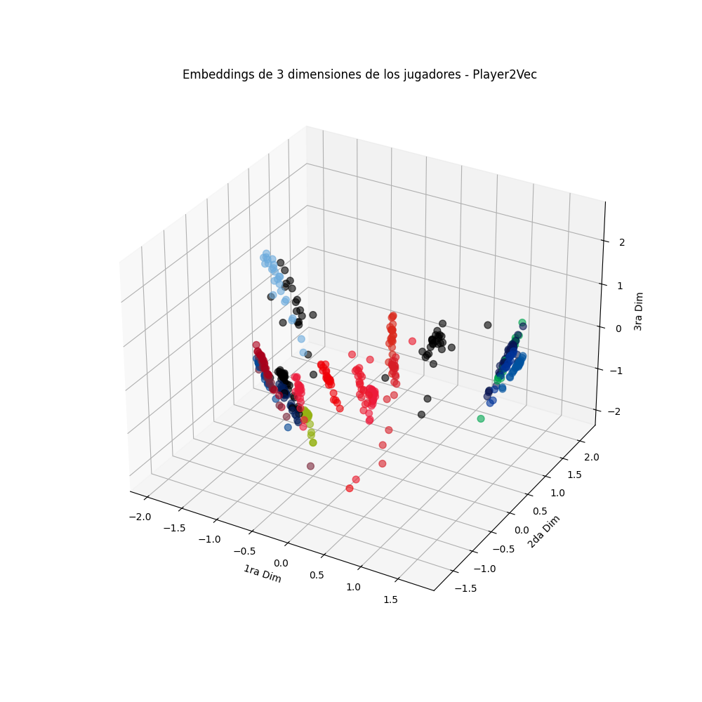
```

Para poder visualizar de forma más clara los embeddings de los jugadores, se realizó un Análisis de Componentes Principales (PCA) para reducir la dimensionalidad de los embeddings a 2 dimensiones. La visualización presente en la figura \@ref(fig:players3d2d) muestra los embeddings de los jugadores en un espacio de 2 dimensiones, el color corresponde al equipo en el que juega el jugador.

\begin{figure}
  \includegraphics{recursos_pdf/graficos/players_3d_2d.png}
  \caption{Embeddings de Jugadores en 3D - PCA a 2D}\label{fig:players3d2d}
\end{figure}

```{r players3d2d, fig.cap="Embeddings de Jugadores en 3D - PCA a 2D", echo = FALSE}
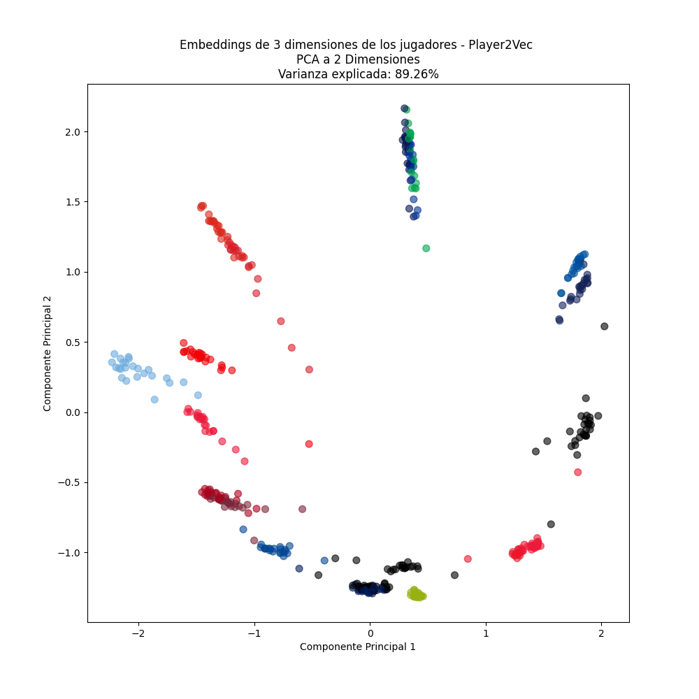
```

En la figura \@ref(fig:players3d2d) se observa cómo los jugadores de un mismo equipo se encuentran cercanos en el espacio vectorial, lo que indica que los embeddings resultantes de este modelo capturan las relaciones entre los jugadores de un mismo equipo.

Además se observa como en este espacio las direcciones en las que se representan a los equipos divergen de forma clara, lo que indica que los embeddings capturan únicamente las diferencias entre los equipos y no las similitudes. Buscan cierta ortogonalidad entre los equipos que no logra existir en este espacio de 3 dimensiones.

Para explotar aún más las relaciones a aprender por el modelo, se ajustó un segundo modelo con las siguientes características:

- Dimensión de embeddings: 64
- Longitud de caminata: 40 nodos
- Número de caminatas: 500
- Tamaño de ventana: 30 nodos

Luego para explorar los embeddings resultantes se realizó nuevamente un análisis de componentes principales para reducir la dimensionalidad de los embeddings a 2 dimensiones.

\begin{figure}
  \includegraphics{recursos_pdf/graficos/players_64_2d.png}
  \caption{Embeddings de Jugadores en 64D - PCA a 2D}\label{fig:players642d}
\end{figure}

```{r players642d, fig.cap="Embeddings de Jugadores en 64D - PCA a 2D", echo = FALSE}
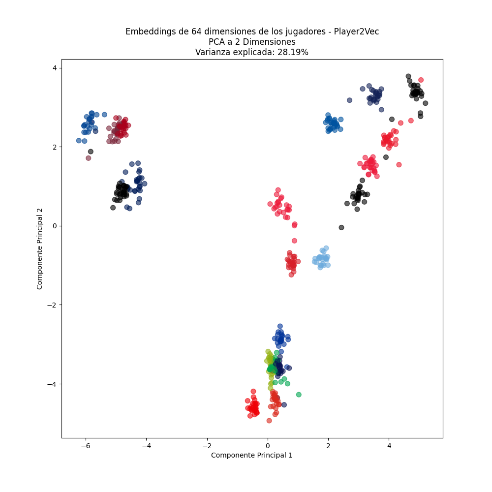
```

En esta figura resultante se puede observar como la direccionalidad de los equipos desaparece pero se mantienen las relaciones entre los jugadores de un mismo equipo.

## Potencial de Player2Vec

Con el modelo planteado de Grafos de Lineups por Equipos y Partidos se puede representar no solo una temporada de una liga, como es nuestro caso, sino que se puede extender a múltiples temporadas y ligas. Esto permitiría poder comparar jugadores de distintas ligas y temporadas, y poder evaluar el rendimiento de un jugador en distintos contextos.

Otra cuestión considerada para expandir es además de tener un nodo general por jugador conectado a sus instancias en cada lineup, se podría tener un nodo que represente a un jugador en un equipo, de forma tal que el jugador real está conectado a su nodo "Jugador en Equipo" y este nodo a su vez conectado a "Jugador en Lineup de Partido de Equipo". Esto permitiría poder evaluar el rendimiento de un jugador en un equipo en particular y como este se comporta en distintos contextos.

En el paper de *Soccer Networks* donde se plantea el PSL definen una serie de coeficientes $h$, $a$, $\omega$, como la performance de un equipo al jugar de local, al jugar de visitante, y la performance ponderada de todos los otros equipos al jugar de visitante respectivamente. Se podrían escalar los ratios de transición entre jugadores y el estado de disparo al arco en función de estos coeficientes para obtener una mejor representación de la performance de un jugador en un partido en particular.

\newpage

\cleardoublepage

# **Modelo predictivo de Distribuciones de Ratios de Transición** ($r(U, V)$) {#modelo-predictivo}

El trabajo de Player2Vec nos permite obtener embeddings de jugadores que capturan las relaciones entre ellos en un espacio vectorial. A partir de estos embeddings, se propone un modelo predictivo de las distribuciones de $r(U, V)$.

## Definición

Dado un jugador $J_i$, se obtiene su embedding $E(J_i)$ a partir del modelo de Player2Vec. 
Para este $J_i$, se busca predecir los estadísticos Media y Varianza de las distribuciones de ratios de transición de $J_i$.

- $r(\text{Gain}, J_i)$
- $r(J_i, \text{Shot})$
- $r(J_i, \text{Loss})$
- $r(J_i, J_j)$
- $r(J_j, J_i)$

Sean $\mu_{\text{Gain}, J_i}$ y $\sigma_{\text{Gain}, J_i}$ la media y la varianza de la distribución de $r(Gain, J_i)$ respectivamente. Análogamente para las otras distribuciones.

Asumiendo normalidad, podemos decir que $r(U, V) \dot{\sim} \mathcal{N}(\mu_{U, V}, \sigma_{U, V})$.

## Modelo

El modelo planteado es una Red Neuronal de la forma:

$$
\begin{aligned}
    f(E(J_i)) &= (\mu_{\text{Gain}, J_i}, \sigma_{\text{Gain}, J_i}, \mu_{J_i, \text{Shot}}, \sigma_{J_i, \text{Shot}}, \mu_{J_i, \text{Loss}}, \sigma_{J_i, \text{Loss}}, \mu_{J_i, J_j}, \sigma_{J_i, J_j}, \mu_{J_j, J_i}, \sigma_{J_j, J_i}) \\
\end{aligned}
$$

La función de pérdida a minimizar es una ponderación de la Divergencia de Jensen-Shannon (JSD) entre la distribución real y la predicha para cada estadístico.

$$
JSD(p || q) = \frac{1}{2} D_{KL}(p||m) + \frac{1}{2} D_{KL}(q||m)
$$

Donde $D_{KL}(p||q)$ es la divergencia de Kullback-Leibler entre las distribuciones $p$ y $q$ y $m = \frac{p + q}{2}$.

## Datos

Para entrenar el modelo, se utilizó un dataset de eventos de partidos de la temporada 2012/13 de la EPL. Se separó la temporada en dos mitades (190 partidos cada una). Con la primera mitad, se construyó un grafo de la red de jugadores $G_{\text{First Half}}$ y se obtuvieron los embeddings de los jugadores con Player2Vec `(dimensions=64, window=30, num_walks=500, walk_length=40)`. Con la segunda mitad, se obtuvieron las distribuciones de ratios de transición de los jugadores.

Luego, de la segunda mitad de la temporada se obtuvieron las medias y varianzas de las distribuciones de ratios de transición de los jugadores. Un 80\% de los datos se utilizó para entrenar el modelo y un 20\% para test.

Especificamente los 521 jugadores de la temporada 2012/13 de la EPL se dividieron en 416 para entrenamiento y 105 para test.

<!-- X_train.shape, X_val.shape, X_test.shape
(torch.Size([332, 64]), torch.Size([84, 64]), torch.Size([105, 64])) -->

```{=latex}
\begin{table}
\caption{Datos de Entrenamiento y Test}
\begin{center}
\begin{tabular}{|c|c|}
\hline
\textbf{Conjunto} & \textbf{Tamaño} \\
\hline
Entrenamiento & 416 \\
Test & 105 \\
Total & 521 \\
\hline
\end{tabular}
\end{center}
\end{table}
```

| Conjunto | Tamaño |
|----------|--------|
| Entrenamiento | 416 |
| Test | 105 |
| Total | 521 |

## Implementación

El modelo se implementó en PyTorch. Se utilizó una red neuronal con la siguiente arquitectura:

\begin{figure}[H]
  \centering
  \includegraphics[width=\textwidth]{recursos_pdf/graficos/p2v_dist_model_H.pdf}
  \caption{Arquitectura del Modelo Base}\label{fig:p2vdistmodelH}
\end{figure}

```{r p2vDistModelH, fig.cap="Arquitectura del Modelo Base", echo = FALSE}
knitr::include_graphics("recursos_pdf/graficos/p2v_dist_model_H.pdf")
```

La función de pérdida utilizada fue la Divergencia de Jensen-Shannon (JSD) entre las distribuciones reales y predichas ponderando las 5 distribuciones a estimar. Se utilizó la implementación de Divergencia de Kullback-Leibler de PyTorch `nn.KLDivLoss` en la implementación del módulo `JSD` hallado en el foro de PyTorch[@alexneakamenipytorchforums_2022_jensen] y este luego se utilizó para la función de pérdida en el entrenamiento del modelo.

## Entrenamiento

Para entrenar el modelo inicialmente, se utilizó el optimizador SGD (Stochastic Gradient Descent) con una tasa de aprendizaje (lr) de `0.005`, un momentum de `0.9` y un weight decay de `0.0005` para prevenir el sobreajuste.

Además, se utilizó un scheduler de tasa de aprendizaje (scheduler) con una estrategia de StepLR, que reduce la tasa de aprendizaje en un factor de `0.1` cada 100 épocas. El entrenamiento se llevó a cabo durante un máximo de 10,000 épocas, con un mecanismo de early stopping para detener el entrenamiento si no se observaban mejoras en el rendimiento del modelo en el conjunto de validación durante un número determinado de épocas consecutivas.

## Resultados iniciales

El modelo base se entrenó con los hiperparámetros y arquitectura mencionados anteriormente, su entrenamiento finalizó en el epoch $2250$.

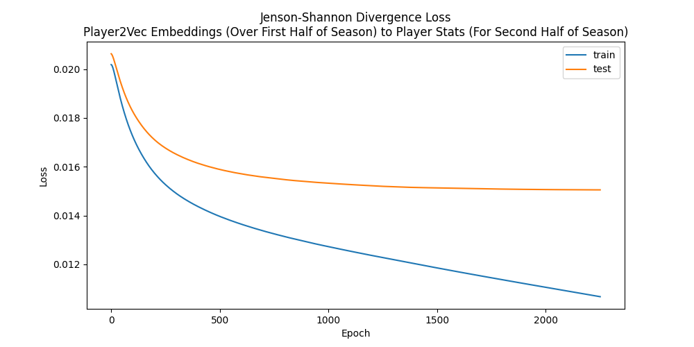

<!-- 
  test_loss	0.01505
  train_loss	0.01068
-->

```{=latex}
\begin{table}
\caption{Resultados del Modelo Base}
\begin{center}
\begin{tabular}{|c|c|c|}
\hline
\textbf{Métrica} & \textbf{Entrenamiento} & \textbf{Test} \\
\hline
Loss & 0.01068 & 0.01505 \\
\hline
\end{tabular}
\end{center}
\end{table}
```

| Métrica | Entrenamiento | Test |
|---------|---------------|------|
| Loss | 0.01068 | 0.01505 |

El modelo base obtuvo un rendimiento aceptable en el conjunto de entrenamiento, con una pérdida de $0.01068$,
pero casi el 50\% mas en el conjunto de test, con una pérdida de $0.01505$. Esto puede ser un indicador de sobreajuste, por lo que se procedió a realizar un proceso de tuning de hiperparámetros y arquitectura con validación cruzada.

## Tuning de Hiperparámetros y Arquitectura con Validación Cruzada

Para mejorar el rendimiento del modelo, se realizó un proceso de tuning de hiperparámetros y arquitectura con validación cruzada. Se evaluaron distintas combinaciones de hiperparámetros y arquitecturas de red neuronal, y se seleccionó la que mejor rendimiento presentó en el conjunto de validación.

Del 80\% de los datos de entrenamiento, se separó un 20\% para validación para hacer holdout CV.

```{=latex}
\begin{table}
\caption{Split Datos de Entrenamiento, Validación y Test}
\begin{center}
\begin{tabular}{|c|c|}
\hline
\textbf{Conjunto} & \textbf{Tamaño} \\
\hline
Entrenamiento & 332 \\
Validación & 84 \\
Test & 105 \\
Total & 521 \\
\hline
\end{tabular}
\end{center}
\end{table}
```

| Conjunto | Tamaño |
|----------|--------|
| Entrenamiento | 332 |
| Validación | 84 |
| Test | 105 |
| Total | 521 |

Con la librería `Hyperopt` [@bergstra_2015_hyperopt], se realizó una búsqueda de hiperparámetros bayesiana. Se evaluaron distintas combinaciones de hiperparámetros, y se seleccionó la que mejor rendimiento presentó en el conjunto de validación.

\subsection{Espacio de Hiperparámetros}

El espacio de hiperparámetros que se exploró fue el siguiente:

\begin{itemize}
    \item \textbf{Tasa de aprendizaje (lr)}: \{0.1, 0.01, 0.001\}
    \item \textbf{Momentum}: \{0.8, 0.9, 0.99\}
    \item \textbf{Weight decay}: \{0.0005, 0.0001\}
    \item \textbf{Optimizador}:
    \begin{itemize}
        \item SGD con momentum
        \item Adam
        \item AdamW
        \item RMSprop con momentum
    \end{itemize}
    \item \textbf{Scheduler}:
    \begin{itemize}
        \item StepLR con step\_size \{50, 100, 200\} y gamma \{0.1, 0.05, 0.01\}
        \item MultiStepLR con milestones \{50, 100, 200\} y gamma \{0.1, 0.05, 0.01\}
        \item ExponentialLR con gamma \{0.1, 0.05, 0.01\}
        \item CosineAnnealingLR con T\_max \{50, 100, 200\}
    \end{itemize}
\end{itemize}

- Taza de aprendizaje: `[0.1, 0.01, 0.001]`
- Momentum: `[0.8, 0.9, 0.99]`
- Weight decay: `[0.0005, 0.0001]`
- Optimizador:
  - SGD con momentum
  - Adam
  - AdamW
  - RMSprop con momentum
- Scheduler:
  - StepLR con step_size `[50, 100, 200]` y gamma `[0.1, 0.05, 0.01]`
  - MultiStepLR con milestones `[50, 100, 200]` y gamma `[0.1, 0.05, 0.01]`
  - ExponentialLR con gamma `[0.1, 0.05, 0.01]`
  - CosineAnnealingLR con T_max `[50, 100, 200]`

Además se implementó una clase de Red Neuronal paramétrica para poder explorar distintas arquitecturas de red neuronal. Se exploraron distintas combinaciones de cantidad de capas ocultas, tamaños de capas ocultas,activaciones y dropout.

## Resultados del Tuning de Hiperparámetros

La búsqueda de hiperparámetros se realizó con 1000 iteraciones. La mejor combinación de hiperparámetros y arquitectura de red neuronal encontrada fue la siguiente:

- Tasa de aprendizaje: $0.01$
- Momentum: $0.9$
- Weight decay: $0.0001$
- Optimizador: `AdamW`
- Scheduler: `CosineAnnealingLR`
  - T_max: $200$
- Arquitectura de red neuronal:
  - Activación: `LeakyReLU`
  - Dropout: $0.3$
  - Número de capas: $8$
  - Tamaños de capas ocultas: `(1024, 256, 64, 256, 256, 16, 32, 512)`

\begin{figure}[H]
  \centering
  \includegraphics[width=\textwidth]{recursos_pdf/graficos/p2v_dist_model_tuned_H.pdf}
  \caption{Arquitectura del Modelo Tuned}\label{fig:p2vdistmodeltunedH}
\end{figure}

```{r p2vdistmodeltunedH, fig.cap="Arquitectura del Modelo Tuned", echo = FALSE}
knitr::include_graphics("recursos_pdf/graficos/p2v_dist_model_tuned_H.pdf")
```

```{=latex}
\begin{table}
\caption{Resultados del Modelo}
\label{tab:resultados_modelo_tuned}
\begin{center}
\begin{tabular}{lrrr}
\toprule
 & Train loss & Val loss & Test loss \\
\midrule
0 & 0.004966 & 0.008916 & 0.014493 \\
\bottomrule
\end{tabular}
\end{center}
\end{table}
```

| Métrica | Entrenamiento | Validación | Test |
|---------|---------------|------------|------|
| Loss | 0.004966 | 0.008916 | 0.014493 |

El modelo final seleccionado obtuvo un rendimiento aceptable en el conjunto de validación, con una pérdida de $0.008916$, aún mejor que la pérdida de Train del modelo base. Se procedió a evaluar el modelo en el conjunto de testeo y se obtuvo una pérdida de $0.014493$.

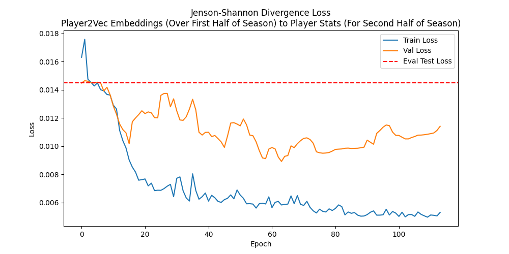

## Hardware y Tiempos de Entrenamiento

El entrenamiento del modelo base se realizó en una máquina con las siguientes características:

Macbook Pro M1 2020
- Procesador: Apple M1
- Memoria RAM: 16 GB
- GPU: 8-core GPU
- 16-core Neural Engine
- OS: macOS Sequoia 15.0.1 (24A348)

- Python 3.10.14
- PyTorch 2.2.2 MPS (Metal Performance Shaders)

El entrenamiento del modelo final tomó tan sólo 30 segundos a lo largo de los 115 epochs que duró el entrenamiento por el mecanismo de early stopping.

La búsqueda de hiperparametros de 1000 iteraciones tomó alrededor de 7hs en la misma máquina.

## Comparación contra _priors_

Para evaluar la capacidad predictiva de nuestro modelo, comparamos los resultados obtenidos con los _priors_ de las distribuciones de ratios de transición de los jugadores. Los _priors_ se obtuvieron a partir de las distribuciones de ratios de transición de los jugadores en la primera mitad de la temporada 2012/13 de la EPL.

Asumiendo que las distribuciones de ratios de transición de los jugadores en la segunda mitad de la temporada son similares a las de la primera mitad, evaluamos su capacidad predictiva con la misma función de pérdida JSD ponderada, obteniendo los siguientes resultados:

```{=latex}
\begin{table}
\caption{Resultados del Modelo vs Priors}
\begin{center}
\begin{tabular}{|c|c|c|}
\hline
\textbf{Priors} & \textbf{Modelo} & \textbf{Modelo Tuned} \\
\hline
0.0353 & 0.01505 & \color{red}{$0.014493$} \\
\hline
\end{tabular}
\end{center}
\end{table}
```

| Priors | Modelo | Modelo Tuned |
|--------|--------|--------------|
| 0.0353 | 0.01505 | $\color{green}{0.014493}$ |

Por lo que se puede observar, el modelo logra una mejora significativa en la capacidad predictiva de las distribuciones de ratios de transición de los jugadores en comparación con asumir igualdad de distribuciones entre las dos mitades de la temporada. En concreto, nuestro modelo logra reducir la pérdida en un $\sim 58.99\%$ en comparación con los _priors_.

\newpage

\cleardoublepage

# **Validación del Modelo de Distribuciones** {#validación-del-modelo}

Para evaluar la capacidad de nuestro modelo en escenarios reales, desarrollamos un caso de estudio basado en las transferencias más importantes en términos de precio y relevancia mediática de los próximos dos mercados de fichajes dentro de la Premier League. Nos limitamos a transferencias internas de esta liga debido a la falta de datos disponibles sobre otras competiciones. Este ejercicio busca medir qué tan bien nuestras métricas y simulaciones pueden justificar o desaconsejar dichas transferencias en función de su impacto en el rendimiento del equipo.

En este apartado, profundizaremos en el análisis de dos casos específicos: la transferencia de Danny Welbeck al Arsenal (septiembre de 2014) y la de James Milner al Liverpool (julio de 2015). Finalmente, presentaremos una tabla resumen con seis transferencias clave, acompañadas de las recomendaciones de nuestro modelo.

Para comparar las distribuciones de PSL de los jugadores involucrados en las transferencias, utilizamos las métricas de comparación de distribuciones presentadas anteriormente: comparación de momentos, dominancia probabilística y dominancia estocástica.

Todo este análisis se realizó asumiendo que las distribuciones de ratios de transición de los jugadores se mantienen, ya que no se cuenta con datos de otras temporadas, por lo que la validación es teórica y contra hechos reales de las próximas temporadas.

## Caso de Estudio 1: Danny Welbeck al Arsenal

Para analizar la transferencia de Danny Welbeck (delantero) al Arsenal, evaluamos el impacto en el PSL del equipo simulando su inclusión en lugar de los principales delanteros titulares. Para ello, consideramos dos escenarios: en el primero, Welbeck reemplaza a Theo Walcott creando la formación $L_{AR1}^{\text{Welbeck}}$ cuya distribución es $X_{L_{AR1}^{\text{Welbeck}}} \sim \hat{f}^{1000}_{PSL}(L_{AR1}^{\text{Welbeck}})$. Y en el segundo, a Olivier Giroud creando la formación $L_{AR2}^{\text{Welbeck}}$ cuya distribución es $X_{L_{AR2}^{\text{Welbeck}}} \sim \hat{f}^{1000}_{PSL}(L_{AR2}^{\text{Welbeck}})$.

Los resultados obtenidos son los siguientes:

\begin{figure}
  \includegraphics{recursos_pdf/graficos/Welbeck_Walcott.png}
  \caption{Comparación de CDFs y PDFs de Welbeck y Walcott}\label{fig:WelbeckWalcott}
\end{figure}

```{r WelbeckWalcott, fig.cap="Comparación de CDFs y PDFs de Welbeck y Walcott", echo = FALSE}

```

<!-- Tabla Comparativa Welbeck vs Walcott -->
```{=latex}
\begin{table}
\caption{Comparación de momentos de $X_{L_{AR1}^{\text{Welbeck}}}$ y $X_{L_{AR1}}$}
\label{tab:comparacion_momentos_psl_Welbeck_Walcott}
\begin{center}
\begin{tabular}{llllll}
\toprule
Jugador & Media & Varianza & Desvío Estándar & Skewness & Kurtosis \\
\midrule
Theo Walcott  &  0.137735 &  0.043914 &         0.001928 &  0.547502 &  0.421810 \\
Danny Welbeck &  0.129325 &  0.038815 &         0.001507 &  0.761120 &  0.773602 \\
\bottomrule
\end{tabular}
\end{center}
\end{table}
```

| Jugador | Media | Varianza | Desvío Estándar | Skewness | Kurtosis |
|---------|-------|----------|-----------------|----------|----------|
| Theo Walcott | 0.137735 | 0.043914 | 0.001928 | 0.547502 | 0.421810 |
| Danny Welbeck | 0.129325 | 0.038815 | 0.001507 | 0.761120 | 0.773602 |

\begin{figure}
  \includegraphics{recursos_pdf/graficos/Welbeck_Giroud.png}
  \caption{Comparación de CDFs y PDFs de Welbeck y Giroud}\label{fig:WelbeckGiroud}
\end{figure}

```{r WelbeckGiroud, fig.cap="Comparación de CDFs y PDFs de Welbeck y Giroud", echo = FALSE}
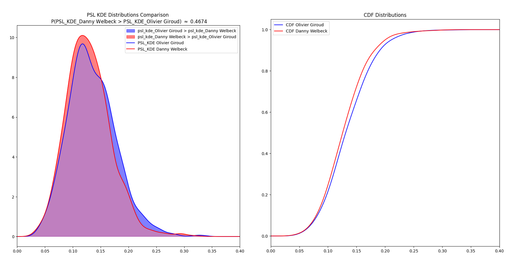
```

<!-- Tabla Comparativa Welbeck vs Giroud -->
```{=latex}
\begin{table}
\caption{Comparación de momentos de $X_{L_{AR2}^{\text{Welbeck}}}$ y $X_{L_{AR2}}$}
\label{tab:comparacion_momentos_psl_Welbeck_Giroud}
\begin{center}
\begin{tabular}{llllll}
\toprule
Jugador & Media & Varianza & Desvío Estándar & Skewness & Kurtosis \\
\midrule
Olivier Giroud &  0.134801 &  0.042535 &         0.001809 &  0.587343 &  0.777267 \\
Danny Welbeck  &  0.128931 &  0.040130 &         0.001610 &  0.700550 &  1.325063 \\
\bottomrule
\end{tabular}
\end{center}
\end{table}
```

| Jugador | Media | Varianza | Desvío Estándar | Skewness | Kurtosis |
|---------|-------|----------|-----------------|----------|----------|
| Olivier Giroud | 0.134801 | 0.042535 | 0.001809 | 0.587343 | 0.777267 |
| Danny Welbeck | 0.128931 | 0.040130 | 0.001610 | 0.700550 | 1.325063 |

Como se puede observar, la distribución de la formación con Walcott, $X_{L_{AR1}}$, presenta una mayor media en PSL en comparación con $X_{L_{AR1}^{\text{Welbeck}}}$. Además, al observar "a ojo" la PDF de $X_{L_{AR1}}$, notamos un mayor sesgo hacia la derecha, lo que indica que la formación con Walcott posee un PSL superior al de la formación con Welbeck en la mayoría de los casos.

Dado que $P(X_{L_{AR1}^{\text{Welbeck}}} > X_{L_{AR1}}) = 0.44$, se sigue que $P(X_{L_{AR1}} > X_{L_{AR1}^{\text{Welbeck}}}) = 0.56$, lo cual indica que la formación con Walcott tiene dominancia probabilística sobre la formación con Welbeck.

Asimismo, podemos concluir que la formación con Walcott domina estocásticamente a la formación con Welbeck, ya que la CDF de $X_{L_{AR1}}$ es mayor que la de $X_{L_{AR1}^{\text{Welbeck}}}$ en todos los puntos a partir del umbral de 0.07.

Todas estas métricas se repiten a favor de la formación con Giroud, $X_{L_{AR2}}$, en comparación con $X_{L_{AR2}^{\text{Welbeck}}}$.

Por lo tanto, podemos concluir que, según nuestro modelo, la transferencia de Danny Welbeck al Arsenal no es recomendable porque su inclusión en lugar de Theo Walcott o Olivier Giroud disminuiría el PSL del equipo y empeoraría la performance del mismo.

### Comparación con la Realidad

La transferencia de Danny Wellbeck al Arsenal del 2014 fue una complicada de evaluar. Por un lado se puede ver que Welbeck tuvo un impacto positivo en el equipo, siendo parte de la plantilla que ganó la FA Cup en 2017 y anotando goles importantes en partidos claves. Sus estadísticas en el Arsenal fueron de 32 goles en 126 partidos (7.006 minútos), con un promedio aproximado de 0.25 goles por partido. Sin embargo, su tiempo en el Arsenal estuvo marcado por lesiones que lo dejaron fuera de juego por largos periodos, lo que limitó su capacidad para mantener una forma y tiempo de juego consistentes.

Se puede considerar también su valor de mercado en el momento de la transferencia, que fue de 20 millones de libras esterlinas, como un indicador de su potencial y calidad como jugador. De la misma forma, podemos observar en la figura \@ref(fig:WelbeckMarketValue) que durante su tiempo en el Arsenal, su valor de mercado fue disminuyendo luego de un año transcurrido en el club, lo que podría ser un indicador de su rendimiento decreciente, posiblemente debido a las lesiones [@danny_transfermarkt]. Su valor de mercado al momento de su transferencia de salida del Arsenal fue de 9 millones de libras esterlinas.

\begin{figure}[H]
  \centering
  \includegraphics[width=\textwidth]{recursos_pdf/graficos/evolucion_valor_mercado_wellbeck.png}
  \caption{Valor de Mercado de Danny Welbeck en el Arsenal - Fuente: Transfermarkt}\label{fig:WelbeckMarketValue}
\end{figure}

```{r WelbeckMarketValue, fig.cap="Valor de Mercado de Danny Welbeck en el Arsenal - Fuente: Transfermarkt", echo = FALSE}
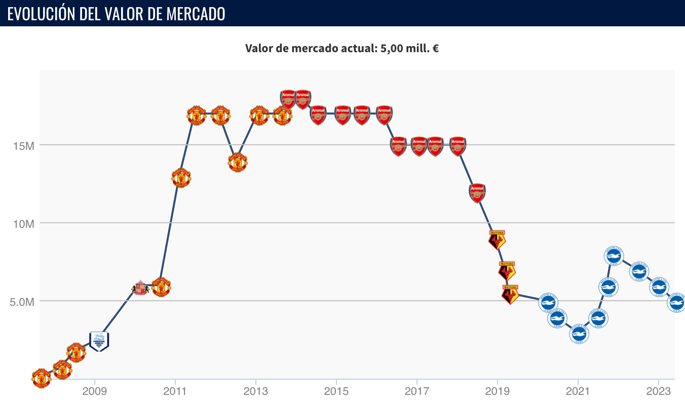
```

Nuestro modelo, puramente por rendimiento en la temporada 2012/13, no pudo prever el impacto positivo que tendría Welbeck en el Arsenal, ya que su inclusión en lugar de Walcott o Giroud disminuiría el PSL del equipo. En cuanto a la comparación con la realidad, se puede observar que Welbeck tuvo un impacto positivo en el equipo, pero sus lesiones limitaron su capacidad para mantener una forma y tiempo de juego consistentes, lo que podría haber afectado su rendimiento y el del equipo.

<!-- \newpage -->

## Caso de Estudio 2: James Milner al Liverpool

Para analizar la transferencia de James Milner (Mediocampista) utilizamos la misma metodología que en el caso anterior. Evaluamos el impacto en el PSL del equipo simulando su inclusión en lugar de los principales mediocampistas titulares. Para ello, consideramos dos escenarios: en el primero, Milner reemplaza a Steven Gerrard creando la formación $L_{LIV1}^{\text{Milner}}$ cuya distribución es $X_{L_{LIV1}^{\text{Milner}}} \sim \hat{f}^{1000}_{PSL}(L_{LIV1}^{\text{Milner}})$. Y en el segundo, a Stewart Downing creando la formación $L_{LIV2}^{\text{Milner}}$ cuya distribución es $X_{L_{LIV2}^{\text{Milner}}} \sim \hat{f}^{1000}_{PSL}(L_{LIV2}^{\text{Milner}})$.

Los resultados obtenidos luego de la simulación son los siguientes:

\begin{figure}
  \includegraphics{recursos_pdf/graficos/Milner_Gerrard.png}
  \caption{Comparación de CDFs y PDFs de Milner y Gerrard}\label{fig:MilnerGerrard}
\end{figure}

```{r MilnerGerrard, fig.cap="Comparación de CDFs y PDFs de Milner y Gerrard", echo = FALSE}
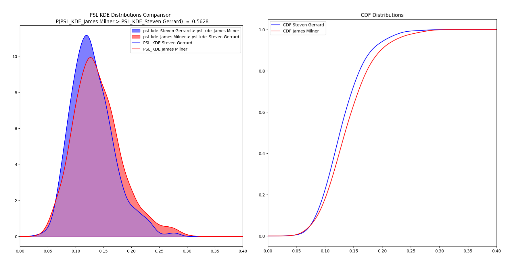
```

<!-- Tabla Comparativa Milner vs Gerrard -->
```{=latex}
\begin{table}
\caption{Comparación de momentos de $X_{L_{LIV1}^{\text{Milner}}}$ y $X_{L_{LIV1}}$}
\label{tab:comparacion_momentos_psl_Milner_Gerrard}
\begin{center}
\begin{tabular}{llllll}
\toprule
Jugador & Media & Varianza & Desvío Estándar & Skewness & Kurtosis \\
\midrule
Steven Gerrard &  0.130349 &  0.038290 &         0.001466 &  0.748219 &  0.862186 \\
James Milner   &  0.139559 &  0.043333 &         0.001878 &  0.703642 &  0.712261 \\
\bottomrule
\end{tabular}
\end{center}
\end{table}
```

| Jugador | Media | Varianza | Desvío Estándar | Skewness | Kurtosis |
|---------|-------|----------|-----------------|----------|----------|
| Steven Gerrard | 0.130349 | 0.038290 | 0.001466 | 0.748219 | 0.862186 |
| James Milner | 0.139559 | 0.043333 | 0.001878 | 0.703642 | 0.712261 |

\begin{figure}
  \includegraphics{recursos_pdf/graficos/Milner_Downing.png}
  \caption{Comparación de CDFs y PDFs de Milner y Downing}\label{fig:MilnerDowning}
\end{figure}

```{r MilnerDowning, fig.cap="Comparación de CDFs y PDFs de Milner y Downing", echo = FALSE}
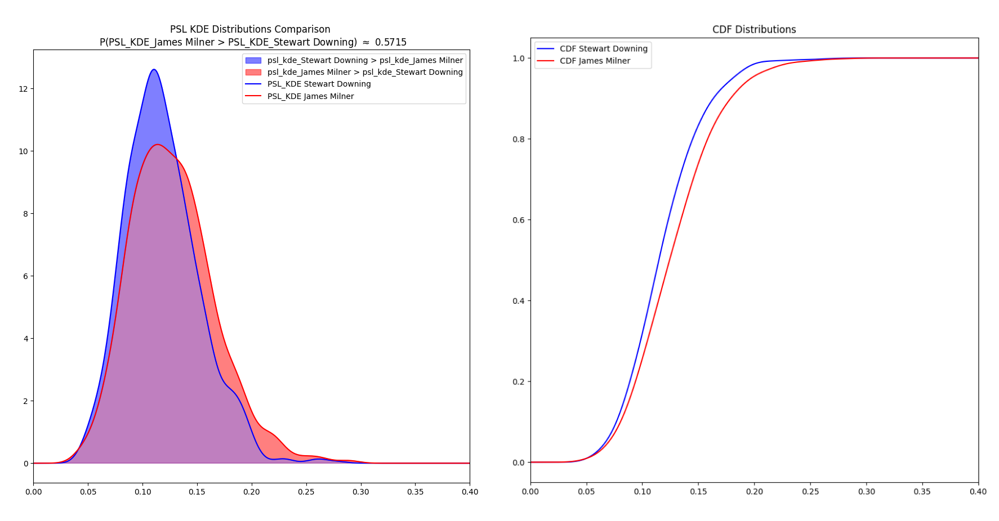
```

<!-- Tabla Comparativa Milner vs Downing -->
```{=latex}
\begin{table}
\caption{Comparación de momentos de $X_{L_{LIV2}^{\text{Milner}}}$ y $X_{L_{LIV2}}$}
\label{tab:comparacion_momentos_psl_Milner_Downing}
\begin{center}
\begin{tabular}{llllll}
\toprule
Jugador & Media & Varianza & Desvío Estándar & Skewness & Kurtosis \\
\midrule
Stewart Downing &  0.117987 &  0.033518 &         0.001123 &  0.696171 &  1.087000 \\
James Milner    &  0.127622 &  0.038303 &         0.001467 &  0.651483 &  0.768572 \\
\bottomrule
\end{tabular}
\end{center}
\end{table}
```

| Jugador | Media | Varianza | Desvío Estándar | Skewness | Kurtosis |
|---------|-------|----------|-----------------|----------|----------|
| Stewart Downing | 0.117987 | 0.033518 | 0.001123 | 0.696171 | 1.087000 |
| James Milner | 0.127622 | 0.038303 | 0.001467 | 0.651483 | 0.768572 |

Como se puede observar, ambas distribuciones con Milner, $X_{L_{LIV1}^{\text{Milner}}}$ y $X_{L_{LIV2}^{\text{Milner}}}$, presentan una mayor media en PSL en comparación con  $X_{L_{LIV1}}$ y $X_{L_{LIV2}}$ respectivamente.
Además, al observar "a ojo" las PDFs de $X_{L_{LIV1}^{\text{Milner}}}$ y $X_{L_{LIV2}^{\text{Milner}}}$, notamos un mayor sesgo hacia la derecha que las originales, lo que indica que las formaciones con Milner poseen un PSL superior en la mayoría de los casos.

Dado que $P(X_{L_{LIV1}^{\text{Milner}}} > X_{L_{LIV1}}) = 0.56$ y $P(X_{L_{LIV2}^{\text{Milner}}} > X_{L_{LIV2}}) = 0.57$, implica que las formaciones con Milner tienen dominancia probabilística sobre las formaciones originales.

También notamos que las CDFs de $X_{L_{LIV1}^{\text{Milner}}}$ y $X_{L_{LIV2}^{\text{Milner}}}$ son mayores que las originales en todos los puntos a partir del umbral de 0.06, lo que indica que las formaciones con Milner dominan estocásticamente de forma parcial a las formaciones originales.

Por lo tanto, podemos concluir que, según nuestro modelo, la transferencia de James Milner al Liverpool es recomendable porque su inclusión en lugar de Steven Gerrard o Stewart Downing mejoraría el PSL del equipo y aumentaría la performance del mismo.

### Comparación con la Realidad

<!-- Partidos: Milner disputó un total de 332 partidos oficiales con el Liverpool.
Goles: Anotó 26 goles durante su tiempo en el club.
Asistencias: Proporcionó 46 asistencias, destacándose como un creador de juego clave.
Títulos: Ganó múltiples trofeos, incluyendo:
3 Premier League
1 FA Cup
1 EFL Cup
1 UEFA Champions League -->

James Milner tuvo una destacada carrera en el Liverpool, donde jugó desde 2015 hasta 2023. Su tiempo en el club se caracterizó por su versatilidad, liderazgo y contribuciones significativas tanto en el mediocampo como en la defensa. Milner disputó un total de 332 partidos oficiales con el Liverpool (19.048 minútos), anotando 26 goles y proporcionando 46 asistencias. Durante su tiempo en el club, Milner ganó múltiples trofeos, incluyendo 3 Premier League, 1 FA Cup, 1 EFL Cup, 1 UEFA Champions League y una medalla de Subcampeón de la Europa League [@milner_transfermarkt]. Su experiencia y profesionalismo lo convirtieron en un líder dentro y fuera del campo. Milner fue clave en momentos decisivos, como su actuación en la final de la Champions League de 2019, donde el Liverpool venció al Tottenham Hotspur.

Nuevamente podemos observar que el valor de mercado de Milner en el momento de su transferencia al Liverpool en el 2015 era de 15 millones de libras esterlinas. En la figura \@ref(fig:MilnerMarketValue) se puede observar que su valor de mercado se mantuvo estable durante sus primeros años en el club, lo que sugiere un rendimiento constante y de alto nivel. Durante su tiempo en el Liverpool, Milner fue un jugador clave [@milner_transfermarkt]. Su valor de mercado al momento de su transferencia de salida del Liverpool fue de 1.5 millones de libras esterlinas.

\begin{figure}[H]
  \centering
  \includegraphics[width=\textwidth]{recursos_pdf/graficos/evolucion_valor_mercado_milner.png}
  \caption{Valor de Mercado de James Milner en el Liverpool - Fuente: Transfermarkt}\label{fig:MilnerMarketValue}
\end{figure}

```{r MilnerMarketValue, fig.cap="Valor de Mercado de James Milner en el Liverpool - Fuente: Transfermarkt", echo = FALSE}
knitr::include_graphics("recursos_pdf/graficos/evolucion_valor_mercado_milner.png")
```

Podemos comparar entonces nuestra simulación con la realidad y observar que nuestro modelo predijo correctamente que la inclusión de James Milner en lugar de Steven Gerrard o Stewart Downing mejoraría el PSL del equipo y aumentaría la performance del mismo. La transferencia de Milner al Liverpool fue recomendable según nuestro modelo, y su impacto en el equipo fue positivo, contribuyendo a los éxitos y títulos obtenidos por el club durante su tiempo en el mismo.

## Recomendaciones de Transferencias Clave

En la tabla a continuación se presentan las seis transferencias más importantes dentro de la Premier League en la temporada 13/14, evaluadas según nuestro modelo. Cada transferencia fue analizada utilizando las distribuciones de PSL del jugador y simulando su impacto en el rendimiento del equipo destino.
Las recomendaciones se clasificaron en:

- **Recomendable**: La transferencia mejora el PSL del equipo destino.

- **No Recomendable**: La transferencia empeora el PSL del equipo destino.

- **Indeciso**: La transferencia no tiene un impacto significativo en el PSL del equipo destino.

<!-- Tabla Resumen de Transferencias Clave -->
```{=latex}
\begin{table}
\caption{Recomendaciones de Transferencias Clave}
\label{tab:recomendaciones_transferencias}
\begin{center}
\begin{tabular}{lllll}
\toprule
Jugador & Posición & Equipo Origen & Equipo Destino & Recomendación \\
\midrule
James Milner & Mediocampista & Manchester City & Liverpool & Recomendable \\
Andros Townsend & Mediocampista & Tottenham & Newcastle & Recomendable \\
Juan Mata & Mediocampista & Chelsea & Manchester United & Recomendable \\
Romelu Lukaku & Delantero & Chelsea & Everton & Indeciso \\
Ryan Bertrand & Defensor & Chelsea & Southampton & No Recomendable \\
Danny Welbeck & Delantero & Manchester United & Arsenal & No Recomendable \\
\bottomrule
\end{tabular}
\end{center}
\end{table}
```

| Jugador | Posición | Equipo Origen | Equipo Destino | Recomendación |
|---------|----------|---------------|----------------|---------------|
| James Milner | Mediocampista | Manchester City | Liverpool | Recomendable |
| Andros Townsend | Mediocampista | Tottenham | Newcastle | Recomendable |
| Juan Mata | Mediocampista | Chelsea | Manchester United | Recomendable |
| Romelu Lukaku | Delantero | Chelsea | Everton | Indeciso |
| Ryan Bertrand | Defensor | Chelsea | Southampton | No Recomendable |

<!-- # **Resultados**  {#resultados} -->

<!-- * **Proyectos de Investigación**: Se presentan los datos o hallazgos obtenidos en la investigación de forma clara y organizada. En este apartado no se deben interpretar los resultados, sólo exponerlos.   -->

\newpage

\cleardoublepage

# **Discusión**  {#discusión}

<!-- * **Proyectos de Investigación**: Aquí se interpretan los resultados obtenidos, comparándolos con la literatura revisada en el marco teórico. Se analizan los hallazgos y se discute su relevancia.   -->

El presente trabajo presenta varias limitaciones y posibles áreas de mejora que deben ser consideradas para futuros desarrollos. En primer lugar, la cantidad de datos de entrenamiento disponibles es limitada, ya que se utilizó solo una temporada de la English Premier League (EPL). Extender el análisis a múltiples temporadas y ligas adicionales permitiría contar con un conjunto de datos más amplio y representativo. Esto no solo mejoraría la capacidad del modelo para generalizar, sino que también fortalecería su validez externa al ser probado en diferentes contextos competitivos y estilos de juego.

En cuanto a la validación del modelo, una metodología más robusta podría incluir el análisis del desempeño de los jugadores recomendados tras integrarse en nuevos equipos. Esto permitiría evaluar directamente si las estimaciones del modelo reflejan un impacto positivo en el rendimiento del equipo y del jugador, lo que fortalecería la confianza en las recomendaciones generadas.

Finalmente, es importante destacar que el modelo carece de ciertas variables contextuales clave. No se han incluido factores como el impacto del equipo rival, las estrategias del entrenador, las condiciones específicas de la fecha (por ejemplo, clima o nivel de fatiga acumulada), ni el efecto de la localía. La incorporación de estas variables podría enriquecer el análisis y permitir una comprensión más completa del entorno competitivo en el que se desarrolla el rendimiento del jugador.

En síntesis, aunque este trabajo ofrece un enfoque inicial prometedor, existe un amplio margen para mejorar la representatividad de los datos, la complejidad del modelo y la validez de las estimaciones a través de futuras extensiones y refinamientos.

\newpage

\cleardoublepage

# **Conclusiones**

En este trabajo, se presentó un modelo predictivo de distribuciones de ratios de transición de jugadores de fútbol basado en embeddings de jugadores obtenidos con **Player2Vec**. El modelo fue entrenado y validado utilizando datos de eventos de partidos de la temporada 2012/13 de la EPL, y se evaluó su capacidad para predecir las distribuciones de ratios de transición de jugadores en un contexto de transferencias.

Se validó y presentó un caso de estudio de dos transferencias clave en las temporadas posteriores de la Premier League, demostrando la capacidad del modelo para evaluar el impacto de las transferencias en el rendimiento de los equipos. A través de la metodólogía propuesta, se encontró que el modelo es capaz de identificar transferencias que mejoran o empeoran el PSL de los equipos, proporcionando recomendaciones útiles para la toma de decisiones en el mercado de fichajes.

Los resultados obtenidos muestran que el modelo es capaz de predecir mejor que los _priors_ las distribuciones de ratios de transición de los jugadores, lo que sugiere que puede ser una herramienta valiosa para la evaluación de transferencias en el fútbol profesional.

\newpage

\cleardoublepage

\newpage

\cleardoublepage

# **Anexo** {#anexo} 

## Distribuciones de ratios de transición de los jugadores

\begin{figure}
  \includegraphics{recursos_pdf/graficos/Top_10_by_counts_players_shots_prob_beta_binomial.png}
  \caption{Distribución de los $r(J, S)$ de los 10 jugadores con mayor cantidad de disparos}\label{fig:Top10bycountsplayersshotsprobbetabinomial}
\end{figure}

```{r Top10bycountsplayersshotsprobbetabinomial, fig.cap="Distribuci&oacuten de los $r(J, S)$ de los 10 jugadores con mayor cantidad de disparos", echo = FALSE}
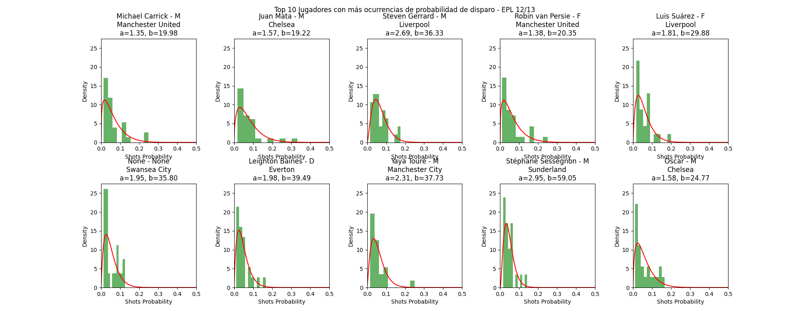
```

\begin{figure}
  \includegraphics{recursos_pdf/graficos/Top_10_by_skew_players_shots_prob_beta_binomial.png}
  \caption{Distribución de los $r(J, S)$ de los 10 jugadores con mayor sesgo}\label{fig:Top10byskewplayersshotsprobbetabinomial}
\end{figure}

```{r Top10byskewplayersshotsprobbetabinomial, fig.cap="Distribuci&oacuten de los $r(J, S)$ de los 10 jugadores con mayor sesgo", echo = FALSE}
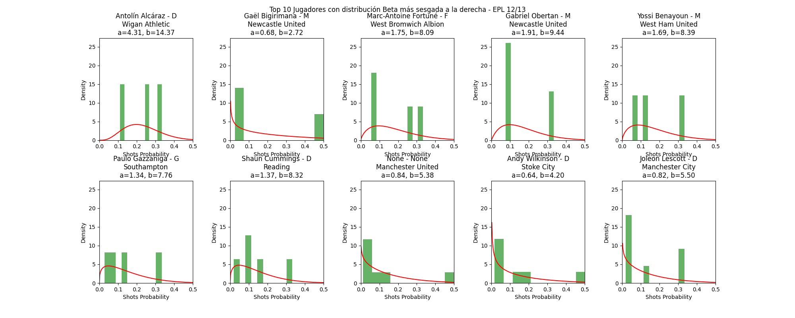
```

\begin{figure}
  \includegraphics{recursos_pdf/graficos/Top_20_Forwards_by_skew_players_shots_prob_beta_binomial.png}
  \caption{Top 20 Delanteros con distribución Beta más sesgada a la derecha - EPL 12/13}\label{fig:Top20Forwardsbyskewplayersshotsprobbetabinomial}
\end{figure}

```{r Top20Forwardsbyskewplayersshotsprobbetabinomial, fig.cap="Top 20 Delanteros con distribución Beta más sesgada a la derecha - EPL 12/13", echo = FALSE}
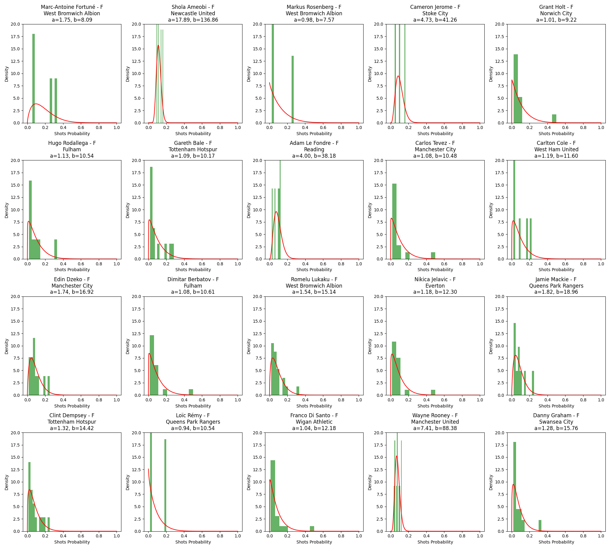
```

\begin{figure}
  \includegraphics{recursos_pdf/graficos/Top_10_by_sum_players_shots_prob_beta_binomial.png}
  \caption{Distribución de los $r(J, S)$ de los 10 jugadores con mayor suma}\label{fig:Top10bysumplayersshotsprobbetabinomial}
\end{figure}

\label{fig:Top10bysumplayersshotsprobbetabinomial}
```{r Top10bysumplayersshotsprobbetabinomial, fig.cap="Distribuci&oacuten de los $r(J, S)$ de los 10 jugadores con mayor suma", echo = FALSE}
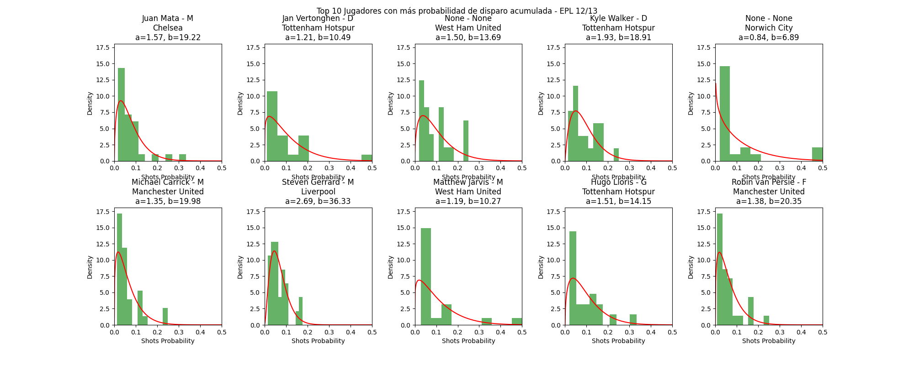
```

<div id="refs"></div>

\newpage

\cleardoublepage

\listoffigures
\listoftables
\listofalgorithmes
