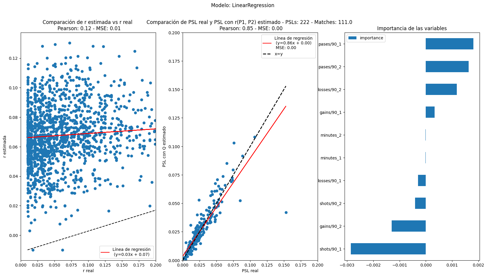

## TD8: Informe Final

**Profesor: Pablo Nussenbaum y Gustavo Vulcano**  
**CABA, Argentina. Diciembre 2024**

Escuela de Negocios  
Licenciatura en Tecnología Digital

\newpage

### **Índice**

<!-- @import "[TOC]" {cmd="toc" depthFrom=1 depthTo=6 orderedList=false} -->

<!-- code_chunk_output -->

- [TD8: Informe Final](#td8-informe-final)
  - [**Índice**](#índice)
  - [**Agradecimientos**](#agradecimientos)
  - [**Abstract**](#abstract)
  - [**Introducción**](#introducción)
  - [**Motivación Justificación del tema**](#motivación-justificación-del-tema)
  - [**Objetivos de Proyecto**](#objetivos-de-proyecto)
  - [**Definición del problema**](#definición-del-problema)
  - 
  - [**Hipótesis**](#hipótesis)
  - [**Marco teórico**](#marco-teórico)
  - [**Marco metodológico**](#marco-metodológico)
  - [**Resultados**](#resultados)
  - [**Discusión**](#discusión)
  - [**Conclusiones & Recomendaciones**](#conclusiones-&-recomendaciones)
  - [**Referencias bibliográficas**](#referencias-bibliográficas)
  - [**Apéndices: Tablas, figuras, anexos**](#apéndices:-tablas)

<!-- /code_chunk_output -->

\newpage

### **Agradecimientos** {#agradecimientos}

Este trabajo no hubiera sido posible sin la ayuda de los profesores Gustavo Vulcano (Escuela de Negocios, Universidad Torcuato Di Tella) y Santiago Gallino (The Wharton School, University of Pennsylvania). Además queremos agradecer a Ignacio Vigilante (TIC \- Escuela ORT) y Tomás Spognardi (Exactas \- UBA) por sus aportes al modelo de Player2Vec y al PSL Bayesiano respectivamente.

### **Abstract** {#abstract}

Un resumen breve (entre 250 y 300 palabras) que debe incluir los puntos clave del trabajo: el problema, los objetivos, la metodología, los resultados más relevantes y las conclusiones principales. Está orientado a brindar una visión general del trabajo.

En la última década, el análisis deportivo ha evolucionado hacia una perspectiva cada vez más matemática y sofisticada. Aplicaciones como el uso de análisis espacial en Basketball (Goldsberry, 2012\) y modelos de juegos de suma cero en fútbol (Hirotsu y Wright, 2006\) son ejemplos claros de la tendencia creciente en este campo. El béisbol, por mucho tiempo el deporte preferido para la analítica, ha experimentado una profunda transformación con la implementación de Sabermetrics (Baumer y Zimbalist, 2014; Wolf, 2015). La introducción de herramientas analíticas avanzadas ha producido resultados positivos para muchos equipos, lo que subraya el valor de estudiar métricas específicas dentro de cada deporte.

Este desarrollo se centra en el fútbol, un deporte en el cual los análisis previos se han concentrado, en su mayoría, en predecir resultados de partidos y mejorar el rendimiento de los equipos. Sin embargo, este trabajo propone un enfoque diferente al analizar la posesión de balón y los disparos, desde una perspectiva probabilística. 

A partir de la métrica PSL (Huang et al), planteamos un proceso para comparar el impacto que tienen los jugadores sobre la performance del equipo. En un enfoque estadístico bayesiano, logramos formular una metodología para estudiar la distribución de la performance de un equipo. Además, desarrollamos un modelo para expandir sobre el modelo teórico de redes de jugadores para representar a cada jugador de forma única y cohesiva. De esta manera podemos hallar jugadores similares y comparar su rendimiento resultante en un nuevo equipo.

### **Introducción** {#introducción}

Presenta el tema del trabajo, su contexto y la importancia. Aquí se debe captar el interés del lector, explicando brevemente los aspectos más importantes que se desarrollarán.

### **Motivación Justificación del tema** {#motivación-justificación-del-tema}

Explica **por qué el tema elegido es relevante**, tanto a nivel académico como práctico. Debe argumentar la importancia del trabajo para el campo de estudio o la sociedad. Similar a lo que se completó en el formulario de licitación de proyectos iniciales.

### **Objetivos de Proyecto** {#objetivos-de-proyecto}

Define claramente **qué es lo que se busca lograr con el proyecto/investigación.** Se suelen dividir en objetivos generales (el propósito principal) y específicos (pasos concretos para alcanzarlo).

Nuestro objetivo general es el de lograr predecir cómo performaría un jugador en un nuevo equipo,

### **Definición del problema** {#definición-del-problema}

Desarrolla el problema o **la pregunta de investigación que motiva el proyecto/investigación**. Aquí se describe en detalle cuál es la situación o fenómeno que se desarrollará/investigará.

A partir de la pregunta de la investigación, se plantea el problema de encontrar el jugador ideal para un equipo de fútbol. En un comienzo nos encontramos planteando como definir _performance_ de un jugador y cómo compararla con otros jugadores. Surgió la necesidad de encontrar una métrica evaluar el impacto de un jugador en el rendimiento de un equipo y como definir estos agentes. Además es necesario poder representar concretamente a un Jugdaor $J$.

#### PSL como métrica de Performance 

En el paper en proceso *How to Find the Right Player for your Soccer Team? (Huang et al.)* se plantea la descomposición del Gol Esperado ($xG$) como:

$$
    xG(A) = P(A) \cdot PSL(A) \cdot SA(A)
$$

Donde $A$ es el equipo, $P(A)$ es la posesión del balón, $PSL(A)$ es la probabilidad patear al arco antes de perder el balón y $SA(A)$ es la probabilidad de que un disparo al arco se convierta en gol. A diferencia de la posesión del balón y la probabilidad de convertir un disparo en gol, $PSL(A)$ no es una métrica comúnmente utilizada en el análisis de fútbol ni existen modelos que la calculen. El paper plantea un modelo de red de jugadores que permite calcular $PSL(A)$ para cada equipo.

Utilizando Cadenas de Markov de Tiempo Continuo (CTMC) se puede calcular la probabilidad de que un equipo pierda el balón antes de patear al arco. A partir de la matriz de ratio de acción sobre tiempo jugado $R$ (ganancias, pases a otro jugador, disparos o pérdidas) se puede obtener la matriz de transición de estados $Q$ y calcular $PSL(A)$.

$$
R = \begin{pmatrix}
    0 & r(G, 1) & \dots & r(G, 11) & 0 & 0 \\
    0 & 0 & \dots & r(1, 11) & r(1, L) & r(1, S) \\
    \vdots & \vdots & \ddots & \vdots & \vdots & \vdots \\
    0 & r(11, 1) & \dots & 0 & r(11, L) & r(11, S) \\
    0 & 0 & \dots & 0 & 1 & 0 \\
    0 & 0 & \dots & 0 & 0 & 1 \\
\end{pmatrix}
$$

Luego obtenemos la matriz de probabilidades de transición $Q$ de normalizar las filas de $R$:

Para cada par de estados $U$ y $V$ se define $q(U, V) = \frac{r(U, V)}{\sum_{i=1}^{14} r(U, i)}$

$$
Q = \begin{pmatrix}
    0 & q(G, 1) & \dots & q(G, 11) & 0 & 0 \\
    0 & 0 & \dots & q(1, 11) & q(1, L) & q(1, S) \\
    \vdots & \vdots & \ddots & \vdots & \vdots & \vdots \\
    0 & q(11, 1) & \dots & 0 & q(11, L) & q(11, S) \\
    0 & 0 & \dots & 0 & 1 & 0 \\
    0 & 0 & \dots & 0 & 0 & 1 \\
\end{pmatrix}
$$

Finalmente a partir de la matriz de probabilidades de transición $Q$ se puede calcular $PSL(A)$ como:

$$
PSL(A) = [1, 0, ..., 0] \cdot (I - T)^{-1} \cdot X \cdot [0, 1]^T
$$

Siendo $T$ las probabilidades de transición de los estados transitorios, $X$ las probabilidades de transición de los estados transitorios a los estados absorbentes e $I$ la matriz identidad.

A partir de este modelo en el paper se evaluó para una temporada de la Premier League (EPL 2012/13) la diferencia entre los PSL de cada equipo y luego de forma empírica se demuestra como el $PSL(A)$ tiene alta correlación positiva con el rendimiento del equipo por sobre el contrincante. Finalmente hayamos una métrica significativa de rendimiento de un equipo en la métrica $PSL$. Sin embargo, da a lugar a la investigacion de como se puede aplicar esta métrica a nivel de jugador y como se puede comparar el rendimiento de jugadores en distintos equipos.

Para evaluar el impacto de un jugador $J$ se debe, o bien conocer la probabilidad de transición entre $J$ y los otros 13 estados (10 jugadores, Ganancia, Pérdida y Disparo) o bien lograr estimar la probabilidad de transición entre $J$ y los otros 13 estados.

En estre trabajo se propone un método probabilistico bayesiano para hayar la Distribución del PSL dada la distribución de probabilidades de transición entre cada uno de los 11 jugadores y los otros 13 estados.

#### Modelo Predictivo de probabilidades de transición

En un comienzo se planteó desarrollar un modelo predictivo para estimar las ratios de transición entre los estados. Optamos por buscar predecir los ratios $r$ y no las probabilidades de transición $q$ ya que la normalización no es igual en cada instancia de $R$. Mas concretamente buscamos estimar la función $f$ que mapea los estados $U$ y $V$ a la ratio de transición $r(U, V)$.

$$
    \hat{r}(U, V) = f(U, V, \theta)
$$

Comenzamos armando un modelo para predecir unicamente los ratios de pases $r(J_i, J_j)$ entre un jugador $J_i$ y otro jugador $J_j$. Para poder utilizar un modelo de machine learning tradicional necestiamos de poder representar a cada jugador $J$ de forma vectorial. Armamos un vector de métricas agregadas para un jugador al momento del partido a predecir. Estas métricas incluyen la cantidad de pases, disparos, goles, pérdidas, etc. sobre el total de tiempo jugado. Luego utilizamos un modelo de regresión lineal para predecir los ratios de pases entre jugadores.

El modelo planteado no es capaz de predecir los ratios de transición, y a pesar de que desarrollamos otros modelos como XGBoost para regressión, Redes Neuronales y Redes Neuronales Probabilisticas (PNNs) no es posible predecir los ratios de transición entre los estados a partir de las métricas de los jugadores. Esto se debe principalmente a la cantidad de datos y la poca relación entre ellos. Sin embargo este revés nos trajo a la luz una particularidad sobre la métrica PSL que no estabamos considerando.

#### Test de Sensibilidad sobre PSL

#### Modelo Predictivo sobre r(J, S)

### Player2Vec

### **Hipótesis** {#hipótesis}

En los casos en que corresponda, la hipótesis es una propuesta que se someterá a prueba a lo largo de la investigación, basada en el planteamiento del problema.

### **Marco teórico**  {#marco-teórico}

* **Proyectos de Investigación**: Aquí se exponen las teorías, antecedentes y conceptos clave relacionados con el tema de estudio. Sirve para fundamentar el trabajo con bases teóricas y estudios previos. Se deben incluir metodologías de desarrollo de software (ágil, Scrum, etc.), paradigmas de programación, tecnologías y frameworks utilizados (por ejemplo, React, Node.js, bases de datos SQL o NoSQL)  
* **Proyectos de Desarrollo**: En esta sección, se debe exponer la base conceptual y técnica que sustenta el proyecto. Esto incluye una revisión de metodologías de desarrollo de software (ágil, Scrum, etc.), paradigmas de programación, tecnologías y frameworks utilizados (por ejemplo, React, Node.js, bases de datos SQL o NoSQL). También se pueden mencionar investigaciones previas o estudios de casos relevantes, siempre enfocándose en cómo estas teorías y tecnologías se relacionan con el proyecto.

### **Marco metodológico**  {#marco-metodológico}

* **Proyectos de Investigación**: Describe el enfoque metodológico utilizado en la investigación, es decir, cómo se va a llevar a cabo el estudio. Incluye el diseño de la investigación, las técnicas de limpieza de datos (si hubo) y el análisis que se hará. Se debe incluir un flujo o diagrama de la arquitectura de la solución planteada.  
* **Proyectos de Desarrollo**: Describe el proceso de desarrollo seguido durante el proyecto. Especifica cómo se organizaron los sprints, las iteraciones, o las fases del proyecto. Incluye también las herramientas empleadas para la gestión del proyecto (Jira, Trello, GitHub) y el enfoque en las pruebas de software para asegurar la calidad del producto final. Se debe incluir un flujo o diagrama de la arquitectura de la solución planteada.

### **Resultados**  {#resultados}

* **Proyectos de Investigación**: Se presentan los datos o hallazgos obtenidos en la investigación de forma clara y organizada. En este apartado no se deben interpretar los resultados, sólo exponerlos.  
* **Proyectos de Desarrollo**: Aquí se detallan los entregables del proyecto de software. Esto puede incluir versiones funcionales del software, demostraciones de características clave, documentación técnica, y análisis de los tiempos de desarrollo o eficiencia lograda. También se pueden incluir métricas como la satisfacción del cliente, el rendimiento del sistema, la escalabilidad o la compatibilidad multiplataforma, según la naturaleza del software desarrollado.

### **Discusión**  {#discusión}

* **Proyectos de Investigación**: Aquí se interpretan los resultados obtenidos, comparándolos con la literatura revisada en el marco teórico. Se analizan los hallazgos y se discute su relevancia.  
* **Proyectos de Desarrollo**: En esta sección, se realiza un análisis crítico de los resultados obtenidos. Compara las metas iniciales del proyecto con los entregables finales y evalúa si las expectativas fueron cumplidas. Reflexiona sobre los desafíos técnicos encontrados, como problemas de compatibilidad, rendimiento, o integración de APIs, y cómo fueron solucionados. Además, discute el impacto potencial del software en la empresa privada para la cual fue desarrollado, evaluando su viabilidad, utilidad, y posibles mejoras para futuras versiones.

### **Conclusiones & Recomendaciones** {#conclusiones-&-recomendaciones}

Se sintetizan los puntos más importantes del estudio, haciendo énfasis en si se cumplieron los objetivos y qué se aprendió a partir de los resultados obtenidos.  
También, se sugieren posibles líneas de investigación futuras o iteraciones del proyecto, aplicaciones prácticas de los resultados o recomendaciones para la implementación de los hallazgos en la vida real.

### **Referencias bibliográficas** {#referencias-bibliográficas}

Lista de todas las fuentes consultadas a lo largo del trabajo, utilizando el formato bibliográfico adecuado.

### **Apéndices: Tablas, figuras, anexos** {#apéndices:-tablas,-figuras,-anexos}

Se incluyen materiales adicionales como gráficos, tablas, cuestionarios, o documentos que sean relevantes pero no forman parte del cuerpo principal de la tesis.  
