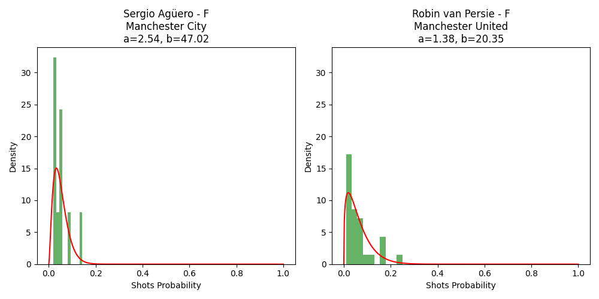
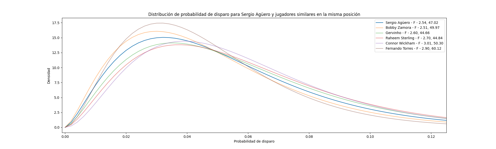
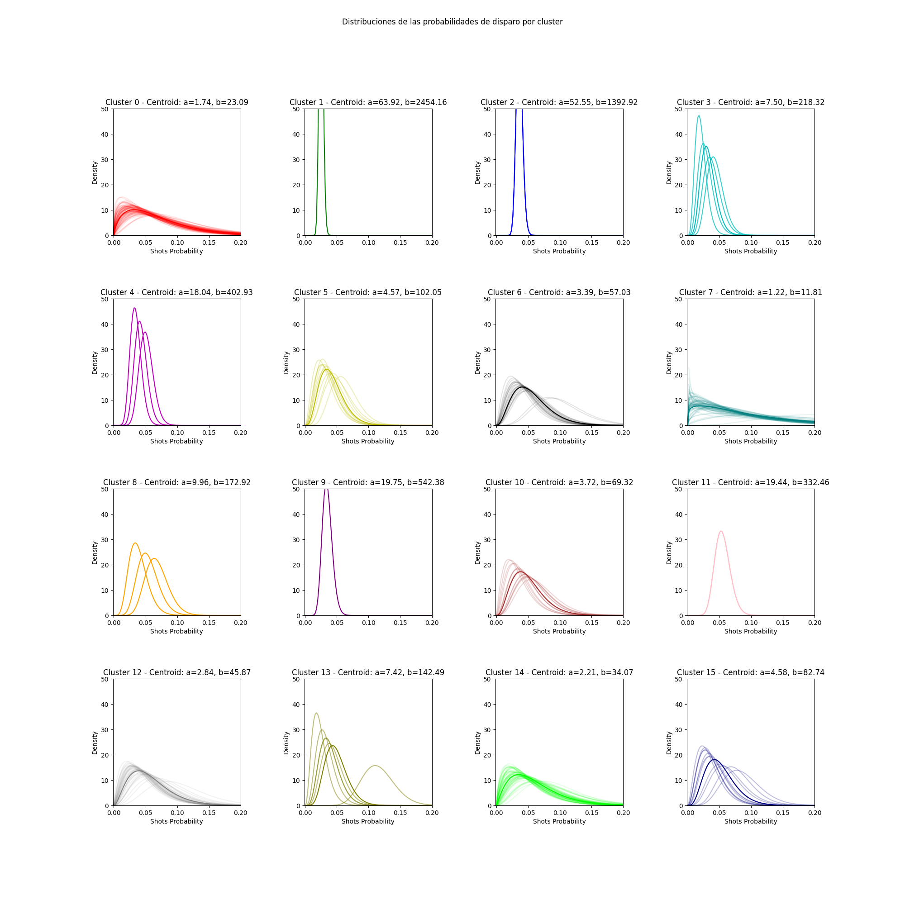
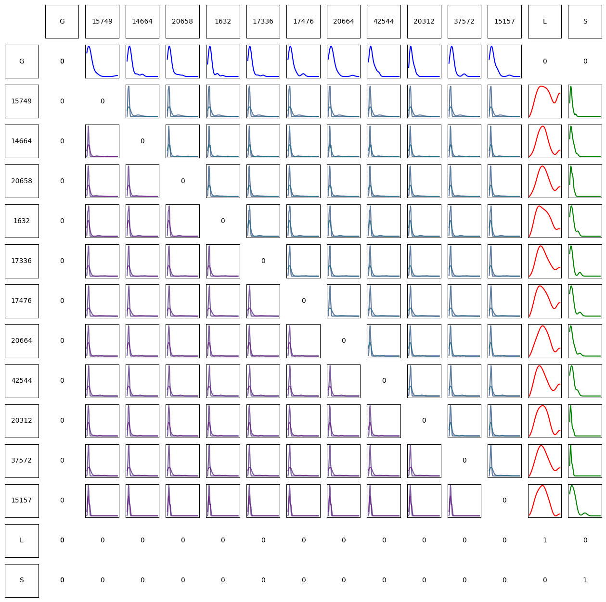
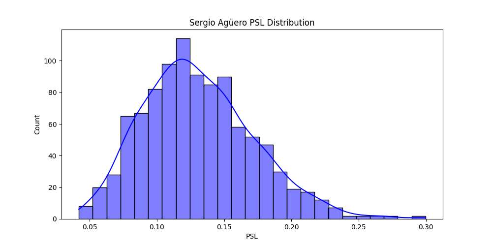

# **Análisis de las distribuciones de los Ratio de Transición a Disparo al Arco** $r(J, S)$

En un esfuerzo de comprender mejor el modelo de ratios de transición entre jugadores y el estado de disparo al arco, se decidió analizar las distribuciones de los $r(J, S)$ para cada jugador en la temporada 2012/13 de la EPL. 

Se observó que las distribuciones de los ratios de transición entre jugadores y el estado de disparo al arco tienen moda cercana a 0, lo que indica que la mayoría de los jugadores tienen una baja probabilidad de disparar al arco antes de perder el balón. En la siguiente figura se puede observar la distribución de los $r(J, S)$ para todos los jugadores de la temporada 2012/13 de la EPL en todos los partidos.

<!--  -->
\begin{figure}
  \includegraphics{recursos_pdf/graficos/Probabilidad_de_disparo.png}
  \caption{Distribución de todos los $r(J, S)$}\label{fig:Probabilidad_de_disparo}
\end{figure}

Además, se observó que la distribución de los $r(J, S)$ de cada jugador no necesariamente sigue una distribución normal ni similar a la de otros jugadores. Para el siguiente análisis se ajustaron las distribuciones de los $r(J, S)$ de cada jugador a una distribución de probabilidad beta y se obtuvieron los parámetros $\alpha$ y $\beta$ de cada jugador. Inicialmente presentamos la distribución de dos jugadores a modo de ejemplo: **Sergio Agüero** y **Robin van Persie**

<!--  -->
\begin{figure}
  \includegraphics{recursos_pdf/graficos/Sergio_Aguero_Robin_van_Persie_shots_prob_beta_binomial.png}
  \caption{Distribución de los $r(J, S)$ de Sergio Agüero y Robin van Persie}\label{fig:Sergio_Aguero_Robin_van_Persie_shots_prob_beta_binomial}
\end{figure}

Luego se analizó la distribución de los $r(J, S)$ de los 10 jugadores con mayor cantidad de disparos, con mayor sesgo y con mayor suma de disparos a modo de comparación. En el [anexo](#anexo) se presentan gráficos correspondientes junto a otras distribuciones pertinentes, ver figuras \ref{fig:Top_10_by_counts_players_shots_prob_beta_binomial}, \ref{fig:Top_10_by_skew_players_shots_prob_beta_binomial}, \ref{fig:Top_20_Forwards_by_skew_players_shots_prob_beta_binomial}, \ref{fig:Top_10_by_sum_players_shots_prob_beta_binomial}

## Comparación de las distribuciones de los $r(J, S)$

A partir de la distribución ajustada de un jugador, podemos hallar jugadores similares en base a la distribución de los $r(J, S)$ utilizando la divergencia de Kullback-Leibler (KL) [@kullback_1951]. La divergencia KL es una medida de la diferencia entre dos distribuciones de probabilidad. Para dos distribuciones de probabilidad $P$ y $Q$, la divergencia KL se define como:

$$
    D_{KL}(P||Q) = \sum_{i} P(i) \log \left( \frac{P(i)}{Q(i)} \right)
$$

En la figura \ref{fig:Similar_to_Sergio_Aguero_shots_prob_beta_binomial} se observa la distribución de los $r(J, S)$ de jugadores similares a él en la temporada 2012/13 de la EPL. Además se presentan solapados en la figura \ref{fig:Sergio_Aguero_and_similar_players_shots_prob_beta_binomial}.

<!--  -->
\begin{figure}
  \includegraphics{recursos_pdf/graficos/Similar_to_Sergio_Aguero_shots_prob_beta_binomial.png}
  \caption{Distribución de los $r(J, S)$ de jugadores similares a Sergio Agüero}\label{fig:Similar_to_Sergio_Aguero_shots_prob_beta_binomial}
\end{figure}

<!--  -->
\begin{figure}
  \includegraphics{recursos_pdf/graficos/Sergio_Aguero_and_similar_players_shots_prob_beta_binomial.png}
  \caption{Distribución de los $r(J, S)$ de jugadores similares a Sergio Agüero Superpuestos}\label{fig:Sergio_Aguero_and_similar_players_shots_prob_beta_binomial}
\end{figure}

Finalmente podemos agregar la condición de _misma posición_ al comparar dos jugadores, en el caso de Agüero de Delantero (F por Forward) y hallar nuevamente jugadores aún más similares a él. 

<!--  -->
\begin{figure}
  \includegraphics{recursos_pdf/graficos/Sergio_Aguero_and_similar_players_same_position_shots_prob_beta_binomial.png}
  \caption{Distribución de los $r(J, S)$ de jugadores similares a Sergio Agüero de la misma posición}\label{fig:Sergio_Aguero_and_similar_players_same_position_shots_prob_beta_binomial}
\end{figure}

Para conocer mejor la varianza de las distribuciones de los $r(J, S)$ de los jugadores, se estudió la distribución de los parámetros $\alpha$ y $\beta$ de las distribuciones beta ajustadas. Hicimos un análisis de clustering para agrupar a los jugadores en base a sus distribuciones de los $r(J, S)$.

<!--  -->
\begin{figure}
  \includegraphics{recursos_pdf/graficos/Clusters_of_Players_shots_prob_beta_binomial.png}
  \caption{Distribución de los parámetros $\alpha$ y $\beta$ de los $r(J, S)$ de los jugadores}\label{fig:Clusters_of_Players_shots_prob_beta_binomial}
\end{figure}

Como un extra, este sistema de clustering nos permite hallar rápido jugadores similares entre sí. A partir de los clusters la siguiente figura presenta las posibles distribuciones en cada cluster.

<!--  -->
\begin{figure}
  \includegraphics{recursos_pdf/graficos/Clusters_of_Players_shots_prob_beta_binomial_distributions.png}
  \caption{Distribución de los $r(J, S)$ de jugadores en clusters}\label{fig:Clusters_of_Players_shots_prob_beta_binomial_distributions}
\end{figure}

\newpage

\cleardoublepage


# **Estimación de la Distribución del PSL**

A partir de los resultados obtenidos en el análisis de las distribuciones de los $r(J, S)$, se propone un utilizar estas como _priors_ para cada jugador, es decir, se asume que la distribución de los $r(J, S)$ de un jugador es la distribución _a-priori_ de la variable aleatoria $r(J, S)$ para ese jugador, lo mismo para los $r(J_i, J_j)$, los $r(J, L)$ y los $r(J, G)$.

De esta forma, cada jugador $J$ tiene una distribución _a-priori_ para cada uno de los 14 estados. Considerando esto, podemos reformular la matriz de ratios de transición como una matriz de variables aleatorias donde cada una se distribuye según la distribución _a-priori_ del jugador correspondiente.

## Variables Aleatorias para los $r(U, V)$ y PSL por _priors_

Para actualizar la notación, sean $r_{J, V}$ la variable aleatoria que representa el ratio de transición entre el jugador $J$ y el estado $V$, esto incluye $r_{J, S}$, $r_{J, L}$ y también $r_{G, J}$, asi como los $r_{J_i, J_j}$ para $i, j \in [1, 11]$.

Luego $r_{J, V} \sim F_x$ la distribución _a-priori_ de la variable aleatoria $r_{J, V}$.

Para generalizar el análisis de distribuciones planteadas en la sección anterior, se propone utilizar una distribución KDE (Kernel Density Estimation) a partir de los histogramas de los $r(J, V)$ para modelar sus distribuciones, ya que no todos los ratios de transición siguen una distribución beta tan bien como los $r(J, S)$.

Finalmente obtenemos, para una formación dada de 11 jugadores, una matriz de variables aleatorias $\mathbf{R}$.

$$
    \mathbf{R} = \begin{pmatrix}
        0 & r_{G, J_1} & \dots & r_{G, J_{11}} & 0 & 0 \\
        0 & 0 & \dots & r_{J_1, J_{11}} & r_{J_1, L} & r_{J_1, S} \\
        \vdots & \vdots & \ddots & \vdots & \vdots & \vdots \\
        0 & r_{J_{11}, J_1} & \dots & 0 & r_{J_{11}, L} & r_{J_{11}, S} \\
        0 & 0 & \dots & 0 & 1 & 0 \\
        0 & 0 & \dots & 0 & 0 & 1 \\
    \end{pmatrix}
$$

Para mejor claridad, la siguiente visualización muestra la matriz de variables aleatorias $\mathbf{R}$ para un equipo de ejemplo. En cada posición se observa la distribución _a-priori_ de la variable aleatoria correspondiente.

<!--  -->
\begin{figure}
  \includegraphics{recursos_pdf/graficos/f9090710-1703-476a-b906-8fddde8ae6d6.png}
  \caption{Matriz de Variables Aleatorias $\mathbf{R}$}\label{fig:8fddde8ae6d6}
\end{figure}

## Método de Monte Carlo para estimar la distribución del PSL

Dado un equipo $A$ con una formación de 11 jugadores $L_{A}$, se busca estimar la distribución del PSL de ese equipo a partir de las distribuciones _a-priori_ de los $r(U, V)$ de cada jugador. Para ello, se propone un método de Monte Carlo para muestrear de las distribuciones _a-priori_ de los $r(U, V)$ y estimar con ellas la distribución del PSL del equipo $A$.

De la formación $L_{A}$ podemos construir la matriz de variables aleatorias $\mathbf{R}$ a partir de las distribuciones _a-priori_ de los $r(U, V)$ de cada jugador.

Definimos $\hat{f}^{N}_{PSL}(L_{A})$ como la función distribución de probabilidad empírica de los $PSL_i$ para la formación $L_{A}$ en base a $N$ simulaciones.

El proceso de Monte Carlo para estimar la distribución del PSL de la formación $L_{A}$ es el siguiente:

```{=latex}
\begin{algorithm}[H]
\caption{Simulación del PSL del equipo $A$}\label{alg:montecarlo}
\SetAlgoLined
\KwIn{Número de simulaciones $N$}
\KwIn{Formación $L_{A}$ = $\{J_1, J_2, \dots, J_{11}\}$}
\KwOut{Distribución del PSL del equipo $A$}
$\mathbf{R} \gets$ Construir la matriz de variables aleatorias a partir de las distribuciones a-priori de los $r(U, V)$ de cada jugador\;
$PSL_i \gets 0$ para $i = 1, 2, \dots, N$\;
\For{$i = 1$ \KwTo $N$}{
    $R \gets $ Muestrear de la matriz $\mathbf{R}$ distribuciones a-priori de los $r(U, V)$\;
    $Q \gets$ Normalizar las filas de $R$\;
    $PSL_i \gets PSL(Q)$\;
}
Estimar la distribución del PSL del equipo $A$ a partir de las $N$ observaciones obtenidas de las simulaciones\;
\end{algorithm}
```

A partir de esta distribución del PSL, se puede realizar comparaciones entre diferentes formaciones de 11 jugadores.

El siguiente gráfico en la figura \ref{fig:sergio_aguero_psl_distribution} muestra la distribución del PSL de una formacíon de ejemplo obtenida a partir de 1000 simulaciones del proceso de Monte Carlo para la formación más utilizada en la temporada 2012/13 de la EPL del equipo Manchester City (10 Jugadores del MCI + Sergio Agüero usado como ejemplo).

<!--  -->
\begin{figure}
  \includegraphics{recursos_pdf/graficos/sergio_aguero_psl_distribution.png}
  \caption{Distribución del PSL del equipo Manchester City}\label{fig:sergio_aguero_psl_distribution}
\end{figure}

## Comparar el impacto sobre el PSL de dos jugadores en una formación

Para comparar el PSL de dos jugadores en una formación, se propone un análisis que consiste en evaluar el impacto en la distribución del PSL al reemplazar a un jugador por otro en la formación. El proceso para ello es el siguiente: 

Se define la Formación $L_{A}$ = $\{J_1, J_2, \dots, J_{11}\}$ como la formación original del equipo $A$, donde alguno de los jugadores $J_i$ es el jugador a "original". 

Se define el jugador $J'$ a comparar con $J_i$ y la formación $L'_A$ = $\{J_1, J_2, \dots, J_{11}\}$ como la formación con el jugador $J'$ en lugar de $J_i$.

Luego, se puede computar $\hat{f}^{N}_{PSL}(L_{A})$ y $\hat{f}^{N}_{PSL}(L'_A)$ para comparar las distribuciones del PSL de las formaciones $L_{A}$ y $L'_A$.
